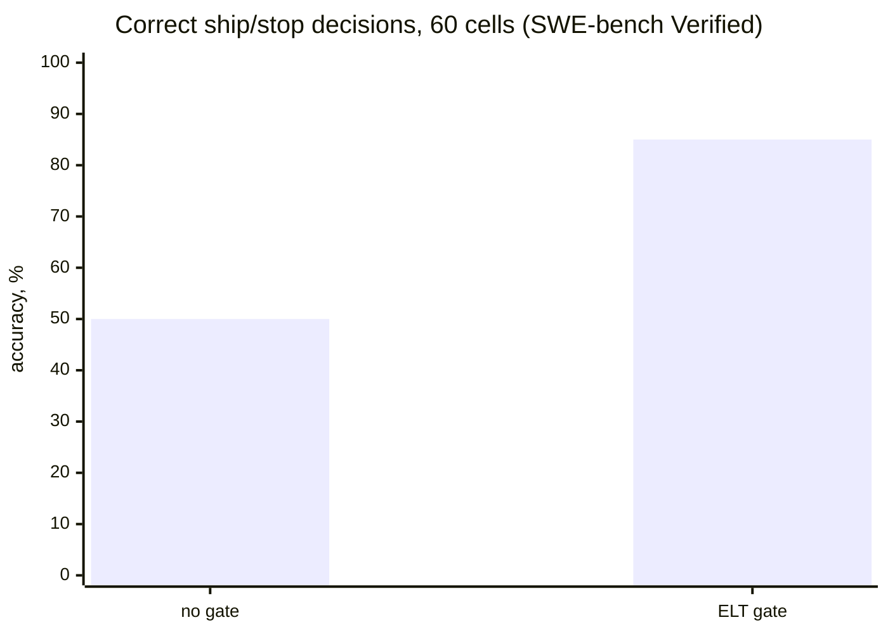
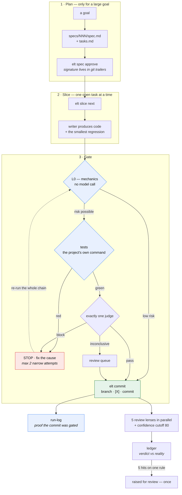

<p align="center">
  <strong>ELT</strong><br />
  <sub>a harness for Claude Code that keeps unverified work out of <code>main</code></sub>
</p>

<p align="center">
  
  
  
  
  
  
</p>

<p align="center">
  <a href="#install">Install</a> ·
  <a href="#what-it-does">What it does</a> ·
  <a href="#does-it-actually-work">Proof</a> ·
  <a href="docs/USAGE.md">Usage</a> ·
  <a href="#what-elt-is-not">Limits</a>
</p>

---

## The problem

Your coding agent finished. It says the change is done. It is confident, it is articulate, and
you have no idea whether it is right.

So you read the diff yourself — and you do that again on the next task, and the one after. The
agent got faster; the bottleneck moved to you. And on the days you don't read carefully,
something broken lands in `main`.

## What it does

ELT sits between the agent and your commit and refuses to let unverified work through.

| | |
| --- | --- |
| 🔬 **Tests run before the model does** | A model is never asked about code whose own tests are red. Mechanical checks are free; model calls are not. |
| ⚖️ **Exactly one judge, no second round** | An independent model reads the diff against the task. `block` means fix the cause — not argue with the reviewer. |
| 🔍 **Five review lenses in parallel** | Bugs, project rules, stale comments, reversed past decisions, repeat feedback — each reads the diff blind to the others' scores, then a cutoff at 80 drops the noise. |
| 📓 **A ledger of its own misses** | When a verdict turns out wrong, it gets recorded. Five hits on one rule raise that rule for review — once. |
| 🔒 **Commits carry proof** | Every commit under the harness leaves a row binding it to the test run and the verdict that let it through. Anything else is visibly ungated. |

Install it as a plugin, type `/elt`, and it works out of what your project already has: your
test command, your git history, your `CLAUDE.md`. There is nothing to configure first and no
service to sign up for.

## Does it actually work?

Measured on a third-party dataset, with the preregistration frozen **before the first result
row**: 30 SWE-bench Verified instances, each with a correct patch and a deliberately broken one,
60 live judge calls.



| | no gate | **with ELT** |
| --- | --- | --- |
| correct ship/stop decisions | 50% — everything ships, by definition | **85.0%** [73.9%, 91.9%] |
| broken patches caught | 0 of 30 | **21 of 30** |
| correct patches wrongly rejected | 0 of 30 | **0/30** |

**Zero false blocks is the number that makes a gate usable.** A gate that stops good work gets
switched off within a week, and then it protects nothing.

<details>
<summary><strong>And the part that is unflattering — read this before quoting the numbers</strong></summary>

* **9/30 broken patches got through.** All nine are cases where the truncated patch stayed
  coherent and reads like finished work. That is the harness's known architectural blind spot:
  the judge checks the diff against the *task*, not against external reality (a live DB schema,
  another API's actual semantics).
* **The harness does not make the writer smarter.** A separate 30-pair experiment on
  `Aider-AI/polyglot-benchmark` found **100.0%** with the harness and 100.0% without it — no
  difference, because the model already solves those tasks on the first try. A negative result
  is reported here as negative.
* **Resolve rate was not measured at all.** No SWE-bench test was executed in either arm. This
  measures the gate's *discriminating power* — the share of issues solved is a different claim
  and this page does not make it.
* Single-hunk instances were excluded from the sampling frame; the conclusion applies to
  multi-hunk patches.

Full write-up, raw rows and preregistrations:
[`benchmarks/gemini-3.7-flash-high/`](benchmarks/gemini-3.7-flash-high/README.md).

</details>

## Install

```powershell
claude plugin marketplace add prodelt/elt-harness
claude plugin install elt@elt
```

Then, in any project:

```powershell
/elt
```

That is the whole setup. Node 18+ and Git are the only requirements — no npm install, no
lockfile, no dependencies to audit. ELT creates its own config on first run, and a missing
config is an `INFO`, never a failure.

→ **[Install, update, rollback](docs/INSTALL.md)** · **[Daily usage and
troubleshooting](docs/USAGE.md)**

### Four commands

| command | what it does |
| --- | --- |
| **`/elt`** | a slice under the gate: plan if needed, tests, one judge, commit |
| **`/elt-verify`** | review the current diff with five lenses in parallel |
| **`/elt-defects`** | record a divergence between a verdict and reality |
| **`/elt-doctor`** | check the install and the project's harness config |

Two hooks work without being invoked: `SessionStart` prints a project summary, and `Stop`
refuses to end a session that left uncommitted work behind.

## How it works

Everything in blue is mechanical and costs no model call.



**`Done` means four things at once** — tests green, smoke green (if configured), one judge
returned `pass` or `inconclusive`, and `elt commit` created both the commit and its proof row.
Three out of four is not done.

A third verdict, `inconclusive`, exists so that "I am not sure" cannot silently become a soft
block: it commits, and it lands in the review queue.

→ **[Architecture and design decisions](docs/ARCHITECTURE.md)**

## What ELT is *not*

Being wrong about this costs more than not using it at all.

* **Not a replacement for your tests.** The judge is the second layer. If a project has no
  meaningful test command, the strongest half of the gate is missing and the model is guessing.
* **Not a check against external reality.** It does not validate a production schema, another
  service's semantics, or whether users actually wanted the feature. It checks the diff against
  the task.
* **Not a compliance control.** There is no independent human authorization step and no
  tamper-evident ledger. For a regulated pipeline, run ELT *alongside* required CI and protected
  branches, not instead of them.
* **Not autonomous.** The review queue needs a person. Nothing here merges on its own.

The harness keeps its own defect registry public, including what is still open:
[`docs/DEFECTS.md`](docs/DEFECTS.md).

## Evidence

Every claim on this page is reproducible from the command that produced it and locked to a
versioned snapshot by a regression test — this page cannot drift from the measurements
silently.

→ **[Measurements, methods and their limits](docs/EVIDENCE.md)**

## Contributing

Issues and pull requests are welcome — see [CONTRIBUTING.md](CONTRIBUTING.md). Security reports
go through [SECURITY.md](SECURITY.md).

## License

MIT — see [LICENSE](LICENSE).
