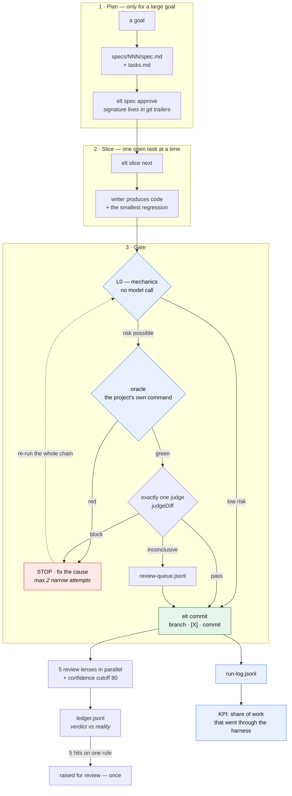
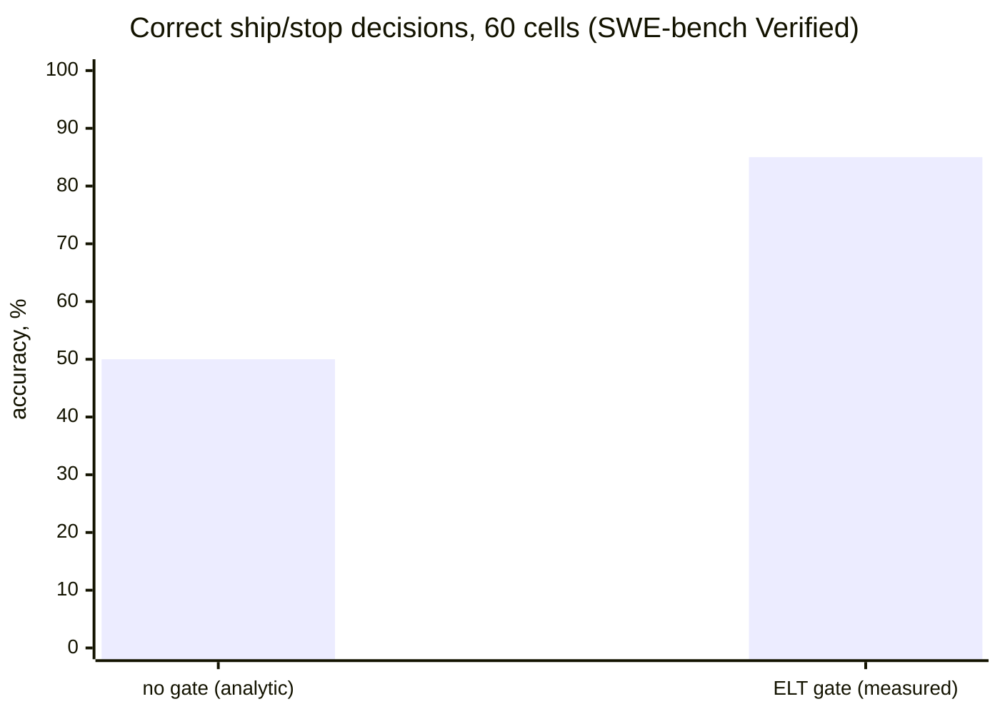
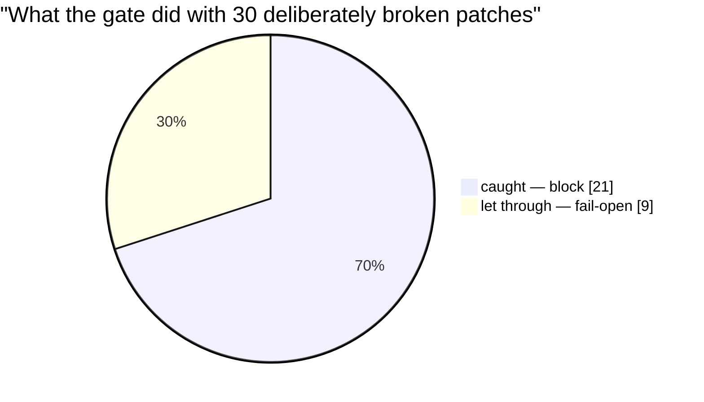

<p align="center">
  <strong>ELT</strong><br />
  <sub>a harness for Claude Code that keeps unverified work out of <code>main</code></sub>
</p>

<p align="center">
  
  
  
  
  
  
</p>

<p align="center">
  <a href="#quick-start--5-minutes">Quick start</a> ·
  <a href="#how-the-harness-works">How it works</a> ·
  <a href="#does-the-harness-actually-help">Benchmark</a> ·
  <a href="docs/INSTALL.md">Install</a> ·
  <a href="docs/USAGE.md">Usage</a> ·
  <a href="#defect-registry">Known defects</a>
</p>

---

# ELT — a harness for Claude Code

A mechanical oracle before the judge, **exactly one** judge, five parallel review lenses behind
a confidence cutoff — and a ledger where the harness records its own misses.

Measured on someone else's benchmark: the gate caught **21 broken patches out of 30** while
rejecting **zero correct ones**. It does **not** make the writer smarter, and this README says
so with the numbers — [see why that distinction is the whole point](#does-the-harness-actually-help).

> [!NOTE]
> Every number on this page comes from the command printed next to it and is locked to
> `tools/kpi-release-snapshot.json` by `node tools/kpi-commit-share.test.js`. This page cannot
> drift from the snapshot silently — that regression exists because it already had, once.

---

## Quick start — 5 minutes

```powershell
# 1. install the plugin (private repo: gh access to prodelt/elt-harness required)
claude plugin marketplace add prodelt/elt-harness
claude plugin install elt@elt

# 2. verify the plugin closure is intact
node bin/doctor.js

# 3. in your own project — create the harness config and close the first slice
/elt
```

In a clean project `doctor` is green: a missing `.harness/harness.json` is `INFO`, not a
failure. `/elt` creates the config itself.

<details>
<summary><strong>What a first slice actually looks like</strong></summary>

```powershell
# what to do next
node tools/elt.js status
node tools/elt.js slice next --spec specs/021-gemini-benchmark-release-readiness

# ...write the code and the smallest regression that proves this branch...

# the gate chain — ONE pass, no writes to the tree in between
node tools/elt.js oracle --full
node tools/elt.js judge run --task T003 --spec specs/021-gemini-benchmark-release-readiness
node tools/elt.js commit    --task T003 --spec specs/021-gemini-benchmark-release-readiness `
  --skip-oracle -m "feat: description"
```

The last step produces three things at once: the commit, the `[X]` in the plan, and a row in
`.git/elt/run-log.jsonl`. That row is the only proof the commit was gated.

</details>

→ **[Install, update, rollback](docs/INSTALL.md)** · **[Daily usage &
troubleshooting](docs/USAGE.md)** · **[Benchmark evidence](benchmarks/gemini-3.7-flash-high/README.md)**

---

## How the harness works

The full loop, from a goal to a commit that counts. Everything in blue is mechanical and costs
no model call.



<sub>Source: [`elt-release-flow.mmd`](specs/021-gemini-benchmark-release-readiness/diagrams/elt-release-flow.mmd) ·
exported for slides and offline docs: [`elt-release-flow.svg`](specs/021-gemini-benchmark-release-readiness/diagrams/elt-release-flow.svg)</sub>

**The three rules this picture encodes:**

1. **The oracle runs before the judge.** A model is never asked about code whose own tests are
   red — that spends a call to rediscover what a test already knows.
2. **There is exactly one judge and no second round.** `block` means fix the cause, not argue.
   A third outcome, `inconclusive`, exists precisely so that "I am not sure" does not silently
   become a soft block: it commits, with a row in the review queue.
3. **Only `elt commit` counts.** A manual `git commit` still works, but leaves no row in
   `run-log.jsonl` — and the share of work that went through the harness is measured from
   exactly that file.

> [!IMPORTANT]
> Run the three gate commands as **one pass, with no writes to the tree in between**. Any write
> between steps yields `stale-tree`; re-running the oracle inside `commit` yields
> `stale-oracle`. That is why `--skip-oracle` is always present in the chain.

<details>
<summary><strong>Batching, and the one thing that breaks it</strong></summary>

A batch of 2–4 closely related tasks from **one** plan: `--task T001,T002,T003` in all three
commands. Never batch across specs, risky architectural changes, or dependent tasks.

**An edit outside the batch's tasks goes into its own slice.** The judge catches it as scope
creep and blocks the *entire* batch, not the one line — this is the most common way a batch is
lost.

</details>

### `Done` means four things at once

| # | condition |
| --- | --- |
| 1 | mechanical oracle exits 0 |
| 2 | smoke exits 0, if one is configured |
| 3 | exactly one judge returned `pass` or `inconclusive` |
| 4 | `elt commit` created the commit **and** the run-log row |

### Four entry points

| command | what it does |
| --- | --- |
| **`/elt`** | a slice under the gate: plan if needed, oracle, one judge, commit |
| **`/elt-verify`** | review the diff with five lenses in parallel, confidence cutoff 80 |
| **`/elt-defects`** | record a divergence between a verdict and reality |
| **`/elt-doctor`** | is the plugin closure intact, is the project harness configured |

Plus two hooks that work without being invoked: `SessionStart` prints a project summary, and
`Stop` refuses to end a session that left uncommitted work behind.

---

## Does the harness actually help?

Two experiments on third-party data, Gemini-only (`agy`, `gemini-3.7-flash-high`). Both
preregistrations were frozen **before** the first result row. Full write-up:
**[benchmarks/gemini-3.7-flash-high/README.md](benchmarks/gemini-3.7-flash-high/README.md)**.

| where it was measured | without the harness | with the harness | conclusion |
| --- | --- | --- | --- |
| **writer** — 30 pairs, `Aider-AI/polyglot-benchmark@7e0611e` | 100.0% | 100.0% | **no difference** |
| **gate** — 60 cells, SWE-bench Verified | 50.0% (analytic) | **85.0%** [73.9%, 91.9%] | **there is a difference** |



> [!TIP]
> **The harness does not make the writer smarter — it keeps bad work out of `main`.** These are
> two different places in the pipeline, and one number cannot describe both. The writer arm hit
> a ceiling: the model solves those tasks on the first try in both arms. A negative result is
> reported here as negative.



| gate failure mode | count | what it costs |
| --- | --- | --- |
| **fail-open** — a broken patch shipped | **9/30** | it would have landed in `main` |
| **false-block** — a correct patch rejected | **0/30** | correct work stopped |
| judge latency | p50 21.0 s / p90 25.3 s | 60 calls, 0 transport failures |

> [!WARNING]
> **Resolve rate was not measured at all.** The "no gate" arm is analytic, not observed: a
> pipeline without a gate ships every patch *by definition*, and there is no per-instance
> SWE-bench environment here to run the real tests. This measures the gate's **discriminating
> power**, not the share of issues solved.

<details>
<summary><strong>The remaining limits of the claim — read before quoting the numbers</strong></summary>

* **Single-hunk instances were excluded** from the sampling frame: for them the synthetic
  negative degenerates into an empty diff that any judge rejects for free. There were 9 of 30 —
  so 30% of the negative arm would have been a free win for the gate. The conclusion applies to
  multi-hunk patches only.
* **All 9 misses** are cases where the truncated patch stayed coherent and reads like finished
  work: `astropy-8707`, `astropy-8872`, `seaborn-3187`, `requests-2931`, `pylint-4661`,
  `pytest-7236`, `scikit-learn-11310`, `sphinx-9461`, `sympy-14531`. That is the same
  architectural hole [declared open below](#defect-registry): the judge checks the diff against
  the task, not against external reality.
* **`inconclusive` never occurred**, so the debatable "inconclusive counts as accept" rule
  changed nothing on this data — it is still recorded in the preregistration, because it would
  change something on another sample.
* The older 3-pair pilot (`benchmarks/results-v5.0.0.json`) is marked `invalid-for-claim` and
  enters no headline number.

</details>

---

## Evidence

Everything below is measured on this repository with the command shown next to it. The numbers
are frozen in `tools/kpi-release-snapshot.json` (`asOf: 2026-08-26`, branch
`feature/elt-v5-one-hour`).

### Share of commits that went through the harness

The single number the harness reports about itself. Everything else measures a mechanism that
may well be switched off.

| sample | share, 2026-08-26 |
| --- | --- |
| three projects combined | **54.6% (106/194)** |
| this repository only | **100% (37/37)** |

```powershell
node tools/kpi-commit-share.js --days 14 --as-of 2026-08-26 `
  --cwd "C:\Claude playground\Pipiline setupper" `
  --cwd "C:\Ametrin projects\Izi_translate" `
  --cwd "C:\Ametrin projects\Izi tracker\izi-tracker"
```

`--as-of` is mandatory: without it the command recomputes the window with today's date and stops
reproducing what is printed here. The method matches `.git/elt/run-log.jsonl` against `git log`
**by hash**, not by time — matching by time inflated the share by counting a manual commit made
a minute after a harness run.

> [!CAUTION]
> Never mix the combined and single-repo samples: the denominators differ, so "the share
> dropped" would only mean another project entered the sample.

### Blocking verdicts: signal to noise

```powershell
node tools/measure-noise.js
```

| when | ratio |
| --- | --- |
| before phase 2 | **1:7** — seven blocks out of eight were false |
| after phase 2 | **8:1** — 8 true, 1 false out of 20 sampled verdicts |

The caveat without which the number lies: **55% unresolved**. Eleven verdicts out of twenty
could not be classified mechanically and are counted on neither side.

The old noise had a single root behind three defects (D9, D15, D19): there was no single list of
"this belongs to the harness" — every check kept its own, and they drifted apart. There is one
list now: `tools/harness-files.js`.

### Mechanical oracle

```powershell
node tools/elt-oracle-runner.js --full
```

**108/108 files** across three roots — `tools/`, `bin/` and `benchmarks/`. The plugin's own
tests and the benchmark contour's tests must be part of the same gate the harness applies to
everyone else: until 021/T003 the benchmark tests had never run on a single commit.

### Our own code

```powershell
find tools bin \( -name "*.js" -o -name "*.ps1" \) | grep -v node_modules | xargs wc -l | tail -1
```

**42,628 lines** across 187 files on branch `feature/elt-v5-one-hour`.

**The phase-3 goal of ≤ 5,000 lines was not met — and it moved further away, not closer.** The
previous figure of 28,272 was measured in the main checkout, which sat on a *different* branch:
it described a tree that is not the one being released. The growth is real release work — the
D27 fixes, the `benchmarks/` measurement contour and its tests. The largest remaining pieces are
load-bearing (`elt.js` 2,254, `doctor-core.js` 966, `judge-core.js` 886): they cannot be
trimmed, only rewritten, and the plugin delivered distribution, not a core rewrite.

### Graph-core latency

| metric | target | measured | status |
| --- | --- | --- | --- |
| `ready → local commit` p95 | < 5 s | **16.5 s** (p50 8.1 s, n=15) | **not met** |
| certification p50 / p90 | published separately | 138 s / 183 s (n=31) | — |
| graph-core LOC | ≤ 1,500 | **893** | met |

Measured at `61f6f3c` (regression: `node tools/graph-kpi.test.js`). The p95 sample includes
batches where landing ran together with repair and file moves; swapping the overall percentile
for a convenient sub-sample would be exactly the fudge this measurement exists to prevent.

---

## Review: five lenses, then a cutoff

The lenses run **in parallel** and never see each other's scores: a scorer seen in advance
collapses five independent readings into one.

| lens | what it looks for |
| --- | --- |
| `review-bugs` | obvious bugs in the changed lines themselves |
| `review-claude-md` | violations of the project's own rules |
| `review-code-comments` | comments that have drifted from the code |
| `review-history` | a change that undoes a deliberate past decision |
| `review-prior-comments` | a repeat of something already pointed out |

The scorer (`claude-haiku-4-5-20251001`) assigns 0–100 with a cutoff of **80**. It knows the
usual false positives by name: generated files, harness-owned files, pure formatting, "add a
test" without naming an uncovered branch, renames with no behaviour change.

## Self-repair ledger

The harness fixes itself from data, not from impressions. `.elt/ledger.jsonl` accumulates four
classes of divergence: `weak-signal`, `miss`, `false-positive`, `harness-defect`. Five entries
for one rule raise it for review — **exactly once**; a sixth does not open a second issue, or
the review queue becomes the very noise the ledger exists to remove.

```powershell
node bin/ledger.js record --kind false-positive --rule diff-size --note "threshold ignored a lock file"
node bin/ledger.js summary
```

## Defect registry

The system reports its own problems. Of 24 numbered defects, 22 are closed.
**Blocking open: zero.**

| # | what | status |
| --- | --- | --- |
| D12 | `agent-browser eval --stdin` silently returns `null` | **open, not ours** — [issue #1](https://github.com/prodelt/elt-harness/issues/1) |
| D24 | `tools/elt-checkpoint.test.js` hangs under `node --test` on Linux | **open, non-blocking** — [issue #2](https://github.com/prodelt/elt-harness/issues/2) |

Full registry with root causes and proof of closure per number:
`.planning/HARNESS-DEFECTS-REGISTRY-2026-08-21.md`.

> [!WARNING]
> One architectural problem is **not** declared closed: the judge checks the diff against the
> spec, not against external reality (a DB schema, another API's semantics). A task that
> contains an error passes the gate — and that same mechanism produces the 9 misses out of 30
> measured above. Partial mitigation: the five review lenses, which read the code rather than
> the task.

## Development

```powershell
node bin/doctor.js                    # plugin diagnostics
node tools/doctor.js                  # project diagnostics
node tools/gen-agents-md.js --check   # instruction drift
node tools/elt-oracle-runner.js --full
```

Instructions live in a single file — `CLAUDE.md`. `AGENTS.md` and `.gemini/GEMINI.md` are
generated from it; editing a copy by hand turns the drift test red. CI runs the oracle on
`windows-latest` and `ubuntu-latest`.

## License

MIT — see [LICENSE](LICENSE).
