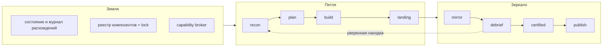

# Архитектура ELT v5

Один документ отвечает на один вопрос: **почему маршрут работы устроен графом, а не памятью
человека**. Всё, что здесь написано, проверяется командами из последнего раздела; если команда
и текст разошлись — верна команда.

## Проблема, из которой всё выросло

Замер по `.git/elt/run-log.jsonl` показал: харнес обходили в 81% коммитов (41 из 220 за 14
дней прошли через него). Разбор причин дал не «людям лень», а два механических отказа:

* **шаг забывали** — гейт покрывал 55,8% коммитов, потому что порядок `oracle → judge → commit`
  жил в голове и в argv;
* **порядок нарушали** — `stale-oracle` возникал за одну секунду без правок человека: дерево
  двигали фон прошлого слайса и авточекпоинт ротации.

Оба отказа — свойства **интерфейса**, а не дисциплины. Отсюда v5: следующий шаг вычисляется, а
не вспоминается.

## Три слоя



**Земля** даёт способности и хранит факты. **Петля** доводит работу до локального коммита
быстро. **Зеркало** проверяет результат дорого — но один раз на батч, а не после каждой задачи.

## Канонический граф

Узлы: `recon → plan → build → landing → mirror → debrief → certified → publish`.
Определение — `graphs/elt-v5.json`, схема — `graphs/schema.json`.

| узел | что доказывает переход дальше |
| --- | --- |
| `recon` | знакомая зона и объём в пределах лимита → `build`; иначе → `plan` |
| `plan` | подпись плана присутствует и не протухла |
| `build` | зависимости задач закрыты, focused-тесты зелёные |
| `landing` | L0 зелёный; создаётся один локальный provisional-коммит без push |
| `mirror` | `batchHead` неизменен; один impact-оракул и один подграф ревью |
| `debrief` | находка ≥80 возвращает в `recon` новым поколением; <80 уходит в ledger |
| `certified` | оракул зелёный, ревью терминально, хеши совпали |
| `publish` | сертификат свежий; терминал |

Три свойства, которые делают граф не украшением:

1. **`advance` — чистая функция.** Ни fs, ни git, ни часов: одно и то же `(state, event,
   evidence)` даёт один результат на Windows и Linux, в фоне и при replay. Иначе proof,
   привязанный к хешам, ничего не доказывает.
2. **Недоказанный guard = невыполненный.** «Не измеряли» никогда не значит «зелено».
3. **Компилятор — граница власти.** Ни один внешний pack не может владеть `identity`,
   `approve`, `oracle`, `certify`, `certificate`, `git`, `commit`, `merge`, `tag`, `push`,
   `release`; на этих способностях `failure` принудительно `block`, а `skip`/`degrade`
   разрешены только неавторитетному обогащению.

## Журнал и две эпохи

Состояние прогона **не хранится** — оно вычисляется из append-only журнала
`.git/elt/graph-journal.jsonl` тем же редьюсером, что и живой переход. Это и есть
детерминированный resume после compact, перезапуска сессии или падения фона.

Правила журнала механические: ровно один терминал на `(runId, batchId, generation)`;
монотонный `seq`; дубликат `(runId, seq)` — no-op, а не вторая запись; запись под межпроцессным
замком. Обрыв процесса посреди записи оставляет неполный хвост — он усекается перед следующей
записью, иначе **одно падение закрывало бы журнал навсегда**.

Эпох две, и переключение между ними разовое:

* `legacy-v1` — авторитет у checkbox в `tasks.md`, approval-трейлеров и `run-log.jsonl`;
* `journal-v1` — авторитет у журнала; `tasks.md` хранит неизменное намерение, а checkbox и
  `state.md` становятся перестраиваемыми проекциями.

`elt cutover` переключает эпоху только при чистом снимке миграции. Любая неоднозначность
(галочка без коммита, коммит без галочки, два коммита на задачу, неразобранная запись очереди,
неподписанная схема `elt-approval/v1`) блокирует переключение и **не пишет ни байта** — это и
есть заявленный rollback: откатывать нечего по построению.

## Батч и сертификация

Батч — 2–4 задачи одной подписанной спеки, dependency-closed, с совместимыми зонами файлов.
Тяжёлые проверки идут **после батча**, не после каждой задачи; в самой посадке остаётся только
L0.

Алгебра `pass` точная: оракул `exit 0` + все требуемые линзы терминально успешны + оценщик
терминально успешен + ноль находок с уверенностью ≥80 + совпадение хешей graph/lock/spec/batch/
generation/commit/tree. `unknown`, `error`, `inconclusive`, `stale` блокируют публикацию.

Красное зеркало **не открывает второй батч**: ремонт увеличивает `generation` того же
`batchId`, обновляет `batchHead`, а proof прошлого поколения становится stale.

Сертификаты батча и релиза — разные версионированные схемы и невзаимозаменяемы: зелёный
батч-сертификат сам по себе не даёт права на релиз.

## Граница для внешних компонентов

Реестр (`.elt/components.json`) объявляет packs и узлы, lock (`.elt/components.lock.json`)
фиксирует содержимое по хешам. Смена lock делает старый proof stale.

Внешний исполняемый узел работает **только вне процесса**: окружение собирается с нуля по
белому списку, поэтому секреты хоста ему физически недоступны; рабочий каталог ограничен
песочницей, вход за её пределы отвергается до запуска; инструментов по умолчанию нет ни одного —
любую способность узел обязан запросить у брокера, и решение принимает ядро. Если платформа не
может обеспечить эту границу, узел получает состояние `unavailable`, а не выполняется «как
получится». Узел без исполнения возвращает только schema-validated предложение и сам ничего не
пишет.

## Как проверить всё, что здесь написано

```powershell
node tools/graph-conformance.test.js   # матрица законных и незаконных рёбор, replay, ремонт, cutover
node tools/graph-kpi.test.js           # измерители: пустая выборка = not-yet-measured, а не ноль
node tools/elt-run.test.js             # одна дверь: resume, дубликат, откат cutover, parity
node tools/capability-broker.test.js   # граница внешних узлов проверяется запуском, не таблицей
node bin/doctor.js                     # graph/journal/packs как ready | degraded | unavailable
node tools/elt-oracle-runner.js --full # весь механический оракул
```

Диаграммы-источники (`.mmd` + `.svg` + `.png` + `.excalidraw`) —
`specs/020-elt-v5-codex-release-certification/diagrams/`: слои и packs, батч и сертификация,
безопасное обновление.
