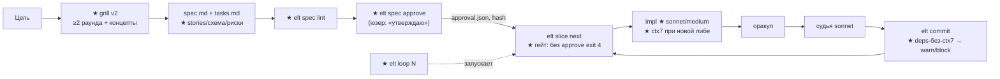

# 006 — ELT Front Gate: механизация передней половины петли

## Проблема
Аудит 2026-07-19/20 (63 сессии за 5 дней + живой код): задняя половина петли
(оракул → судья → `elt commit`) переведена в код и работает (39 судейских
вызовов, реальные block'и). Передняя половина — проза, и она **не исполняется**:
grill-me 0 вызовов, PlanMode 0, спеки пишутся за 2 минуты и **не показываются
юзеру на утверждение**, вопросов юзеру ≤3 на новый проект. Автономный драйвер
0 запусков за 5 дней (вход ручной, выгода не видна), ctx7 2 вызова, новые
проекты стартуют мимо системы (copywrighter: 108 мин на Opus без git).
Итог: система 7/10 как код, 4.5/10 как работающая практика. Полный отчёт —
чат-сессия e6d18838 (2026-07-19), карта слабостей — memory
`project_harness_weak_spots_2026-07-19` (W1–W9).

## Решения (зафиксированы с пользователем 2026-07-19/20)
- **Утверждение спеки — механический гейт, не проза.** `elt spec approve` пишет
  подпись (hash-связанную с содержимым); `elt slice next`/`commit` отказывают
  по неутверждённой спеке. Тот же принцип, что judge-proof на commit (наш
  доказанный паттерн), перенесённый на вход петли.
- **Grill v2 — структурный протокол**, а не 8 строк прозы: разведка кода →
  минимум 2 раунда AskUserQuestion по категориям с рекомендованными ответами →
  для UI 2–3 варианта концепции → выход = секция «Решения» в spec.md.
- **Спека обогащённая:** User stories, Mermaid-схема, таблица рисков, не-цели —
  и показывается юзеру **чанками на подпись** (паттерн obra/superpowers), не
  простынёй. Полнота проверяется механически (`elt spec lint`).
- **Экономика «дорогой архитектор — дешёвые руки»:** планирование в интерактиве
  на сильной модели; исполнение слайсов драйвером на sonnet/medium (дефолт
  конфига, а не дефолт CLI юзера — сейчас драйвер наследует opus/xhigh).
- **Вход в луп тривиальный:** `elt loop [N]` из любого проекта; статус и след
  прогона видны в `elt status` (ответ на «я не понимаю, работает ли луп»).
- **ctx7 — гейт, а не привычка** (запрос юзера «обязательно»): новые зависимости
  в манифестах без записи в ctx7-логе → warn/block на `elt commit`.
- **Единый вход для новых проектов:** SessionStart-хинт (1 строка, silent при
  наличии харнесса) — юзер явно принял глобальный хук в этих границах
  (анти-AMOS: без инжекта каждый ход, без LLM в хуке).

## User stories
- Как владелец продукта, я хочу, чтобы по крупной цели агент сначала прогнал
  меня по вопросам и показал спеку кусками на утверждение, чтобы код резался
  по моим решениям, а не по догадкам модели.
- Как пользователь, я хочу запускать автономный прогон одной короткой командой
  и видеть в `elt status`, что он сделал, чтобы доверять лупу и экономить
  дорогие интерактивные часы.
- Как ревьюер качества, я хочу, чтобы слайс с новой внешней либой не
  коммитился без свежей ctx7-выжимки, чтобы код писался по актуальным API.
- Как владелец системы, я хочу, чтобы новый проект сам предлагал вход в ELT,
  чтобы проекты не стартовали «мимо» (кейс copywrighter).

## Схема (флоу после 006; ★ — новое)

## Критерии приёмки
1. В проекте со `spec.md` и `specApproval:true`: `elt slice next` без
   валидного approval → exit 4 с понятным сообщением; после `elt spec
   approve` — выдаёт слайс. Правка spec.md/tasks.md после подписи → гейт
   снова закрыт (stale), `elt spec status` это показывает.
2. `elt spec lint` перечисляет отсутствующие обязательные секции (Проблема,
   Решения, User stories, Критерии приёмки, Риски, Вне scope) и падает,
   пока они не появятся; `approve` не проходит без зелёного lint.
3. Драйвер и fleet не стартуют по неутверждённой спеке (pre-run чек как
   codegraph-guard).
4. grill-me v2: на крупной цели производит ≥2 раундов вопросов по категориям
   и фиксирует блок «Решения» в spec.md (проверка live-fire T018).
5. `elt loop 2` из корня проекта запускает драйвер; в loop-логах видна
   модель имплементатора из `harness.json` (дефолт sonnet), не дефолт CLI.
6. Новая зависимость в манифесте без записи в `.harness/ctx7-log.jsonl` →
   warn (или block по `ctx7Gate`) на `elt commit`.
7. `elt commit` гарантирует `.git/elt/run-log.jsonl` (репро кейса
   Marketing_tg_bot, где лог не появился) — тест воспроизводит и чинит.
8. Новый код-проект без `.harness` → ровно одна строка-хинт на старте сессии;
   с харнессом — тишина.
9. Оракул репо зелёный: `node tools/elt-oracle-runner.js`; изменения elt.js
   покрыты тестами в `tools/` (паттерн elt-*-proof.test.js).

## Риски
| Риск | Влияние | Митигация |
|---|---|---|
| elt.js живёт в `~/.claude` (второй git-репо) | рассинхрон коммитов | как в 005: слайс коммитит оба репо, тесты в tools/ зовут CLI по абсолютному пути |
| PS5.1 тихие сбои (W6) в новых шагах драйвера | молчаливый блок | новые шаги — через Node-мосты (claude-invoke-паттерн), stderr не глушить |
| Approve-гейт душит микро-задачи | трение | гейт активен только при `spec.md` рядом с tasks.md И `specApproval:true`; `--skip-approval` с громким следом в run-log |
| SessionStart-хук = глобальная поверхность | AMOS-рецидив | 1 строка, silent-выход, <4s, без LLM; судья ревьюит анти-AMOS границы |
| Rate-limit при прогоне слайсов | стоп петли | слайсы атомарны, resume через tasks.md; драйвер дробит по -Slices |

## Оракул
- Этот репо: `node tools/elt-oracle-runner.js` (вкл. новые тесты слайсов).
- Скиллы/доки-слайсы: контракт-тесты на наличие/структуру файлов + судья.

## Вне scope (кандидаты в 007)
- Визуальный гейт UI-слайсов (agent-browser скриншот → судья-визуал против
  DESIGN.md) — главный рычаг «качества дизайна», отдельная спека.
- Мета-оракул «no test, no slice» (W3) и mutation/coverage-гейты.
- Skills-discovery в План-шаге (`npx skills find` + сканер CLI + наш судья).
- Beads-style ready-graph для fleet; снятие Fleet-experimental (ждёт A/B).
