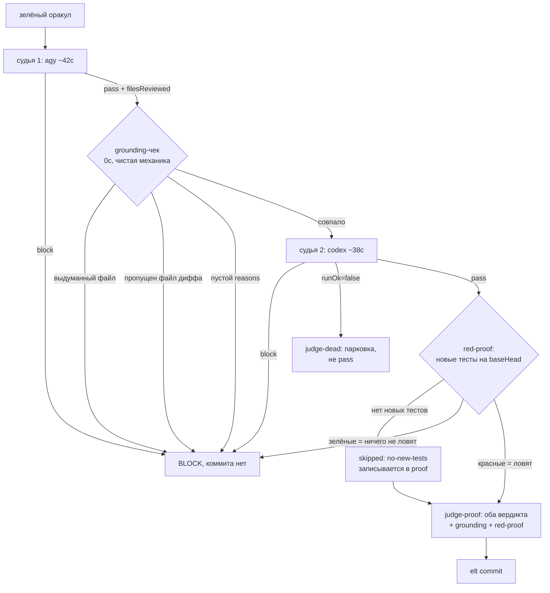

# 008 — Усиление судьи: доказанное подтверждение вместо быстрого «pass»

## Проблема

Судья — единственная семантическая точка харнесса (W2 в карте слабых мест). Сейчас это
ОДИН вызов LLM, чей вывод принимается на веру: сказал `pass` — слайс уходит в коммит.

Три дыры, все наблюдались живьём:

1. **Галлюцинация не отличима от работы.** Судья может вынести вердикт, не разобрав дифф.
   Механической проверки «он вообще смотрел эти файлы?» нет. Коммит `7f8183b` (2026-07-22):
   sonnet-судья дал `pass` с `"reasons": []` — вердикт без единого обоснования прошёл гейт.
   Быстрая модель (`agy/gemini-3.6-flash-high`) даёт это чаще: скорость 42с куплена глубиной.
2. **Одна модель = одна точка отказа.** `judge-bench` меряет судью на 14 синтетических
   кейсах, но в проде вердикт выносится однократно и не перепроверяется. Промах модели на
   реальном диффе ничем не ловится.
3. **Зелёный оракул ≠ работающий код.** Оракул зелён ровно настолько, насколько честны его
   тесты. Тест, который проходит и до правки (мокает проверяемую логику, ассертит на мок,
   не завязан на новое поведение), даёт зелёный оракул при неработающем коде. Сейчас это
   ловит только текстовое требование в промпте судьи — то есть та же LLM, которой мы и не
   доверяем.

Итог: «слайс закрыт» означает «модель сказала ок», а не «доказано, что работает как задумано».

## Решения (зафиксированы с пользователем 2026-07-22)

Три независимых слоя поверх существующего судьи. Ни один не заменяет другой — они ловят
разные отказы, и любой из трёх даёт `block`.

1. **Grounding-чек (механика, 0с).** Судья обязан вернуть `filesReviewed` — список файлов,
   которые он разобрал. Сверяется кодом со списком файлов диффа: назвал несуществующий →
   галлюцинация; пропустил реальный → судил не весь слайс. Оба случая → `block`. Плюс
   `reasons` обязан быть непустым при любом вердикте.
2. **Двойной судья (verify-on-pass).** Первичный остаётся быстрый `agy`. Его `pass` —
   не вердикт, а заявка: её подтверждает второй судья `codex/gpt-5.6-sol` (отдельная
   подписка, не ест Claude-лимит; на бенче 8/9, единственный промах — ложный `block`,
   то есть ошибается в безопасную сторону). `block` от любого = `block`. Цена платится
   только на `pass`, `block` короткозамыкает сразу.
3. **Red-proof (механика, доказательство работы).** Новые/изменённые тесты слайса
   прогоняются против кода ДО слайса (worktree на `baseHead` + тестовые файлы из диффа).
   Ожидание — они падают. Зелёные на старом коде → тест не проверяет новое поведение →
   `block`. Это единственный слой, который проверяет не мнение о коде, а поведение кода.

Выбор пользователя явный: полный контур (все три), второй судья — codex, порядок —
сначала 008, потом остаток 006 драйвером уже под усиленным гейтом.

## User stories

- Как владелец харнесса, я хочу, чтобы `pass` от быстрой модели без разбора диффа
  отклонялся кодом, а не замечался мной постфактум при чтении коммита.
- Как владелец харнесса, я хочу, чтобы «слайс закрыт» означало «есть тест, который падал
  до слайса и проходит после», а не «оракул зелёный».
- Как оператор автономного прогона, я хочу видеть в `judge-proof` оба вердикта и результат
  red-proof — чтобы после ночного прогона проверять доказательства, а не доверять статусу.
- Как владелец бюджета, я хочу, чтобы вторая проверка стоила только на `pass` и уходила на
  отдельную подписку, не съедая Claude-лимит.

## Критерии приёмки

1. Судья, назвавший файл, которого нет в диффе, → `block` с причиной `grounding:phantom-file`;
   судья, пропустивший файл диффа, → `block` с `grounding:unreviewed-file`. Тест на обоих.
2. `reasons: []` при любом вердикте → `block` (`grounding:no-reasons`). Вердикт `pass` с
   пустым обоснованием невозможно провести через гейт.
3. При `judge.verify` в конфиге: `pass` первичного зовёт второго; `block` любого = итоговый
   `block`; `runOk=false` второго = `judge-dead` (парковка), НЕ молчаливый `pass`.
4. `block` первичного НЕ зовёт второго (нет лишней траты).
5. Red-proof: слайс с тестом, зелёным на `baseHead`, → `block`; слайс с тестом, красным на
   `baseHead`, → проходит; слайс без новых тестов → `skipped:no-new-tests`, зафиксировано
   в proof, не молчаливый пропуск.
6. `judge-proof.json` содержит `judges[]` (оба вердикта с моделями), `grounding` и `redProof`;
   `elt commit` отвергает proof без этих полей при включённом контуре (exit 4).
7. Обратная совместимость: без `judge.verify` и с `redProof:"off"` контур ведёт себя
   как сегодня — существующие тесты гейта зелёные.
8. Перемер `judge-bench` (14 кейсов) на усиленном контуре: recall по дефектам не ниже
   текущего agy-показателя, ложные `pass` не выросли. Отчёт в `.harness/judge-bench/`.
9. Полный оракул зелёный на каждом слайсе; спека закрыта только с живым прогоном
   усиленного гейта на реальном слайсе (не на стабах).

## Риски

- **Grounding даёт ложные block** на обрезанном диффе (cap 12000): судья физически не видит
  хвост и не может его перечислить. Митигация: полный список файлов подаётся в промпт
  отдельной секцией из `git status` (не зависит от cap); при обрезке контента это явно
  сказано судье.
- **Red-proof красный по «неправильной» причине** (import-error нового модуля вместо
  ассерта). Считаем красным — тест всё же завязан на новый код, — но пишем в proof, чем
  именно красный, чтобы не выдавать это за полное доказательство.
- **Время слайса растёт** на ~60-90с (второй судья + прогон тестов). По замеру гейт = 24%
  времени слайса, имплементатор = 76%; рост терпимый, но батч (`batch:3`) становится
  важнее — гейт платится один раз на батч.
- **Codex-судья недоступен/не авторизован** → `runOk=false` → парковка слайса вместо
  коммита. Это осознанно: недоказанный слайс не коммитится.
- **Red-proof на не-node проектах**: команда прогона одного теста различается. Конфиг
  `harness.json.testCmd`; не задан и не детектится → `skipped:no-test-cmd` с явной записью.

## Вне scope

- Замена первичного судьи на более сильную модель (решение: agy остаётся, его подтверждают).
- Мутационное тестирование в полном виде (мутанты по коду) — red-proof это его дешёвая
  однопроходная версия.
- Fleet-путь параллельных воркеров (гейт общий — усиление наследуется автоматически,
  отдельных слайсов не требует).
- Ретроспективная перепроверка уже закрытых слайсов усиленным судьёй.
- Метрики стоимости судей в деньгах (это 005 T021, Fleet ledger).
