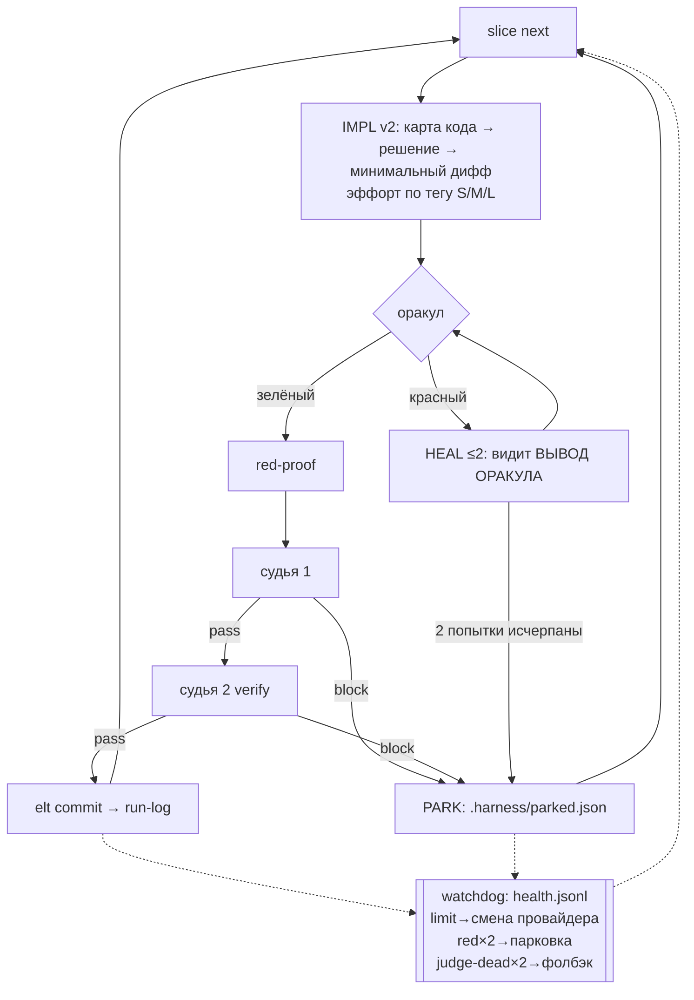

# 009 — ELT v3: честный гейт, непадающая петля, watchdog, fleet-роли

## Проблема

Аудит 2026-07-24 (141 сессия с 19.07, 205 записей run-log в 4 проектах, ledger живого
fleet-прогона, чтение `elt.js`/`elt-loop.ps1`/`fleet/*`) нашёл четыре класса дефектов.
Все — измеренные, не гипотезы.

**1. Гейт формально работает, содержательно — нет.**
- `gate.js:255` обрезает дифф на 12 000 символов. Реальные диффы слайсов в
  `<another-project>`: 67K, 66K, 44K, 27K, 25K, 17K — 6 из последних 12 коммитов выше
  cap. При этом `checkGrounding` требует, чтобы судья перечислил КАЖДЫЙ файл полного списка
  (`gate.js:197`). Судья на большом слайсе может только соврать или дать ложный block.
  Контур против галлюцинаций сам их производит.
- Весь контур 008 выключен: `circuitEnabled()` (`elt.js:282`) требует `judge.verify` или
  `redProof` в `harness.json` — их нет ни в одном проекте. Живые `judge-proof.json` без
  `judges[]`/`grounding`/`redProof`. Двойной судья, grounding и red-proof не отработали ни разу.
- В интерактиве вердикт — самозаверение: `writeJudgeProof` (`elt.js:330`) пишет то, что дали
  в argv, а SKILL.md просит того же агента, что писал код, напечатать `--verdict pass`.
  Вся живая работа идёт интерактивом (social-analysis 35 коммитов, Route_API 4, impl-сессий
  драйвера там ноль) — то есть механического судьи в проде нет вообще.

**2. Петля хрупкая.** `elt-loop.ps1` делает `break` на red-stop (:213), judge-block (:252),
judge-dead (:247), codegraph-guard (:162), пустом диффе (:226). Один трудный слайс из четырёх
обнуляет прогон. Self-heal (:201) кладёт в промпт хвост лога ИМПЛЕМЕНТАТОРА, а не вывод
оракула — модель чинит, не видя ошибки теста.

**3. Харнесс режет мышление.** Промпт имплементатора (`elt-loop.ps1:176`) — 6 строк, 5 из них
запреты; ни слова про разведку системы. Fleet-воркеры бегут в `--safe-mode` (`providers.js:128`)
— без skills, MCP (codegraph), hooks и CLAUDE.md. Эффорт зафиксирован `impl=high/heal=max`,
теги `[S]/[M]/[L]` не читаются. Замер: impl-сессия = 52 turns, 8 мин, до 205K контекста;
codegraph — 26 вызовов на 6000 tool-calls за 5 дней (0.4%).

**4. Fleet-роли не выдерживают живого прогона.** Ledger 22.07: `implement/agy` — 9 nonzero
exit из 10 (5 limitHit, 3 timeout), `judge/agy` — 4 из 5 nonzero, `implement/codex` — 4 из 4 ok.
Провайдер падает — слайс падает, ретрая другим провайдером нет.

**5. Автопоиска проблем нет.** `doctor.js` ручной, `harness-selfcheck.js` только про красный
оракул харнесса, `elt-code-audit.js` раз в неделю. Всё вышеперечисленное уже лежит в
run-log/ledger и никем не читается во время работы.

## Решения (зафиксированы с пользователем 2026-07-24)

- **Судья вызывается кодом, а не прозой.** `elt judge run --task Txxx` спавнит судью
  субпроцессом (тот же путь, что у драйвера — `judge-invoke.js`) и сам пишет proof. Печатать
  вердикт руками нельзя: при `harness.json.judge.attest:true` `judge-proof write` без
  машинного происхождения отвергается. Цена (+40–90 с на гейт) принята; судью можно увести на
  codex/agy, чтобы не жечь Claude-лимит.
- **Fleet: agy пишет, claude+codex ревьюят, с авто-failover.** Воркер по умолчанию agy; при
  limitHit/timeout слайс перевыдаётся следующему провайдеру цепочки (codex), а не падает.
  Ревью = существующий двойной судья (`judge` + `judge.verify`).
- **agy контролируется механически, а не на доверии** (решение пользователя 2026-07-24: agy
  галлюцинирует). Три слоя, ни один не стоит LLM-вызова:
  (1) **worker-attestation** — воркер обязан закончить JSON `{"filesChanged":[…],"testsAdded":[…]}`;
  код сверяет со ВСЕМ реальным git-диффом worktree, как `checkGrounding` сверяет судью:
  заявленный файл не изменён → `hallucinated-file`, изменён незаявленный → `undeclared-file`,
  дифф пуст при непустой заявке → `phantom-work`. Любое расхождение — слайс НЕ идёт к судье,
  а перевыдаётся следующему провайдеру (та же дорожка, что failover по лимиту).
  (2) **red-proof обязателен для fleet-слайсов** (сейчас только в solo-пути): тест, добавленный
  agy, обязан падать на `baseHead`, иначе `redProof:green` = слайс не доказан.
  (3) **agy никогда не судит сам себя**: если воркер agy, `judge.provider`/`verify` для этого
  слайса резолвятся в других провайдеров (проверка в коде, не в конфиге).
- **Watchdog чинит известные классы сам.** Детект поверх run-log/ledger в реальном времени;
  авто-действия ограничены закрытым списком (сменить провайдера, припарковать задачу,
  откатить судью на фолбэк). Всё прочее — запись в `.harness/health.jsonl` + громкий отчёт,
  без самоназначения работы.
- Судья видит дифф ПОФАЙЛОВО с честной пометкой обрезки; grounding спрашивает только за то,
  что судье реально показали.
- Петля паркует проблемный слайс и продолжает со следующего, а не выходит.
- **Ускоряем impl, а не гейт.** Замер 24.07: имплементатор = 485 с из ~600 с слайса (76–80%),
  гейт = 24%. Батч задач до одного гейта уже существует с 22.07 и даёт ≈1.2× — это его потолок,
  он экономит только оставшиеся 24%. Поэтому главный рычаг — карта зоны кода в промпте
  (убрать слепой Read: 52 turns и до 205K контекста на слайс), а внутри гейта — параллельный
  red-proof и авто-батч мелких слайсов. Ниже T012–T013.

## User stories

1. Как разработчик я запускаю автономный прогон на 6 слайсов и получаю 5 закрытых + 1
   припаркованный с диагнозом — вместо «1 закрыт, прогон умер на втором».
2. Как разработчик я вижу в `judge-proof.json` два вердикта разных моделей и список реально
   прочитанных файлов — и знаю, что судья запускался, а не был объявлен.
3. Как разработчик я запускаю fleet, где код пишет gemini, а ревьюят claude и codex, и лимит
   одного провайдера не роняет слайс.
4. Как разработчик я получаю от харнесса сообщение «провайдер в лимите, переключил на codex»
   вместо трёх молчаливых падений подряд.
5. Как имплементатор-модель я получаю задачу вместе с картой кода и правом сначала разобраться,
   а не пять запретов и однострочник.

## Критерии приёмки

1. Дифф > cap: судья получает пофайловые секции с явной пометкой обрезанных файлов; grounding
   требует `filesReviewed` только по показанным файлам; тест воспроизводит 60K-дифф и доказывает,
   что честный вердикт больше не блокируется.
2. `elt judge run --task T001` пишет валидный proof с `judges[]` (≥1) и `grounding.filesReviewed`;
   при `judge.attest:true` ручной `judge-proof write --verdict pass` отвергается exit 4.
3. `harness.json` этого репо и двух живых проектов содержит `judge.verify` + `redProof`;
   `circuitEnabled()` = true; первый же новый proof содержит все три поля.
4. Драйвер на плане с заведомо непроходимым слайсом закрывает остальные и завершается с
   ненулевым числом припаркованных; `elt status` показывает парковку.
5. В heal-промпте присутствует хвост вывода оракула (доказать тестом на подставном красном оракуле).
6. `node tools/harness-watch.js --once` на подготовленном run-log выдаёт: limit-серию,
   повторный red по одной задаче, judge-dead-серию; авто-действия пишутся в health.jsonl и
   применяются только из закрытого списка.
7. Fleet: воркер, упавший по limit/timeout, перевыдаётся следующему провайдеру цепочки;
   ledger содержит запись `failoverFrom`; слайс доходит до гейта.
8. Fleet-воркеры больше не бегут с `--safe-mode` по умолчанию (codegraph/skills доступны);
   откат `FLEET_LEAN=1`.
9. Worker-attestation: воркер, заявивший файл, которого нет в диффе (или сделавший работу
   молча), не доходит до судьи — слайс перевыдаётся; расхождение видно в ledger. Тесты на все
   три отказа (`hallucinated-file`, `undeclared-file`, `phantom-work`) + на честную заявку.
   agy-воркер не может получить agy-судью ни первичным, ни verify.
10. Ускорение доказано замером, а не ощущением: 3 слайса до и 3 после карты зоны — сравнение
    turns/времени/контекста из run-log; параллельный red-proof даёт тот же вердикт.
11. Живой прогон ≥4 слайсов на реальном проекте с включённым контуром: все коммиты имеют
    полный proof, watchdog-лог не пуст, отчёт с замером времени гейта до/после.

## Риски

- **Цена гейта растёт** (два судьи + red-proof + вызов кодом). Смягчение: судья по умолчанию
  на codex/agy, батч 2–4 задачи, red-proof только на pass.
- **Пофайловый дифф раздувает промпт судьи** на больших слайсах. Смягчение: бюджет на файл и
  общий бюджет, приоритет тестовым файлам и коду задачи, честная пометка «обрезано».
- **`judge.attest:true` ломает привычный интерактив** (агент больше не может закрыть слайс без
  внешнего вызова). Смягчение: включаем в этом репо и живых проектах, дефолт для новых —
  через `project-bootstrap`; аварийный обход `--skip-attest` оставляет громкий след в run-log.
- **Watchdog чинит не то.** Смягчение: закрытый список действий, каждое пишется в health.jsonl,
  ни одно не трогает код и git.
- **agy-воркер останется нерабочим** даже с failover (лимиты free-tier). Смягчение: failover
  делает это видимым в ledger, решение о ролях принимается по цифрам после T009.

## Вне scope

- Переписывание `elt.js` или fleet-оркестратора; изменения только точечные.
- Снятие experimental-метки с fleet (зависит от внешнего A/B на Ametryn).
- Замена оракула, новые провайдеры, любые UI/дашборды.
- Обучение/файнтюнинг моделей, смена дефолтной модели имплементатора.
- Миграция deprecated-поверхности (Pipeline v3, Agent Harness v1) — это `specs/005` §9.
