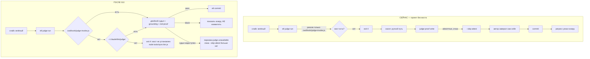

# 010 — Доставка контура качества в реальные проекты

**Повод:** аудит 89 сессий за 26–29.07 (`.planning/CHECKPOINT-2026-07-29-elt-quality-regression-audit.md`).
**Ветка:** `feature/judge-bench-parallel-oracle`.

## Проблема

Контур судьи (спеки 008/009: attest, двойной судья, red-proof, grounding) работает **только в
репо-разработчике**. В реальных проектах он объявлен в `harness.json`, но физически не установлен —
и деградирует в самозаверение автором кода.

| проект | мост судьи | записей | block | pass | `--skip-attest` |
|---|---|---|---|---|---|
| Pipiline setupper | есть | 82 | **29** | 14 | **0** |
| Route_API_1C | нет | 27 | **0** | **27** | **20** |
| doc2md-tauri | нет | 11 | **0** | **11** | 2 |

Block-rate 67% (судья = код) против 0% (судья = проза + `--skip-attest`).
В том же окне юзеру уехали 3 регресса, все с вердиктом `pass`.

Механика отказа (`tools/elt.js:606`): мост резолвится **только** как `<cwd>/tools/judge-invoke.js`.
В `~/.claude/bin/` его нет, `project-bootstrap.js` про него не знает (grep: 0 упоминаний).
Цепочка: `judge run` exit 4 → скилл шлёт на ручной путь → `judge-proof write` отвергнут
(`attest:true`) → `--skip-attest` → автор кода заверяет сам себя.

## Решения (зафиксированы с пользователем 2026-07-29)

**Р1. Порог — D1+D2+D4** (ядро доставки). D3 (гейт одной транзакцией) и D5 (`.gitignore`,
`elt.cmd`) — в бэклог: это трение и мусор, а не дыра в контуре.

**Р2. Миграции нет.** Мост кладётся один раз в `~/.claude/bin/judge/`, `elt.js` резолвит
`<cwd>/tools/judge-invoke.js` → иначе глобальный. Ноль правок в проектах, ноль дрейфа копий.
9 живых проектов чинятся сами при следующем `elt judge run`.

**Р3. `--skip-attest` удаляется, а не конфигурируется.** Нет судьи → нет коммита; слайс
паркуется. Тот же закон, что уже принят в fleet (T010: `judgeAwayFrom` → `null`). Осознанная
цена: на машине с одним живым CLI гейт непроходим; потолок снимается установкой второго CLI,
не ослаблением инварианта.

**Р4. D0 (рантайм-регрессы) — разведка с заранее объявленным порогом.** Слайс T001 отвечает
числом: поймал бы smoke-контракт N из 3 уехавших регрессов. **N≥2 → smoke-слайсы дописываются
в этот tasks.md** (спека расширяется, нужен повторный `approve`). **N≤1 → стоп, отдельная
спека 011** с другим подходом.

**Р5. Скиллы — точечно.** Правятся только места, легитимизирующие ручной путь и самозаверение
(`elt/SKILL.md`, `elt-onboard`, `harness-method`). Полный аудит 4 скиллов — не в scope.

**Р6. Хуки — только глушение авто-чекпоинта на время гейта.** Остальной активный слой хуков
(dirty-exit, git-guardrails, codegraph) не трогаем.

**Р7. Приёмка — живой блок в чужом проекте** (Route_API_1C), не зелёный оракул репо.

### Разведанные факты (не спрашивались — проверены в коде)
- **`fleet.js:182` уже починен** в `28aa4b7` (T010): `judgeAwayFrom` возвращает `null` →
  парковка `judge-unavailable`, а не судью == воркер. Пункт «НЕ ПРОВЕРЕНО #3» чекпоинта устарел.
  Fleet целиком — вне scope.
- **Поверхность — 9 проектов, а не 122.** `.harness/harness.json` есть у: `Pipiline setupper`
  (мост есть), `Ametryn_protocol_bot` ×3, `project_social_analysis`, `Route_API_1C`,
  `Marketing_tg_bot`, `pdv`, `tg_bot_reclamaties-master`, `Ametrin web ecosystem 4` (моста нет).
  122 — это папки чатов, не харнессы.
- **Замыкание моста — 8 файлов:** `judge-invoke.js` → `fleet/gate.js` →
  `fleet/{providers,exec,plan,router}.js` + `red-proof.js` + `elt-config.js` (последний уже
  лежит в `~/.claude/bin/`).
- **Копия, а не шим на репо.** Шим (`require` пути репо) короче, но fleet исполняет слайсы
  в git worktree, а репо переезжает между ветками — путь нестабилен. Дрейф копии ловится
  механически (`doctor`), нестабильный путь — нет.

## User stories

**US1.** Как разработчик в проекте без `tools/judge-invoke.js`, я запускаю `elt judge run` и
получаю настоящий вердикт двойного судьи — без правок в проекте и без ручного пути.

**US2.** Как разработчик, я не могу заверить собственный код: люка `--skip-attest` больше нет,
недоступный судья паркует слайс, а не пропускает его.

**US3.** Как владелец системы, я запускаю `project-bootstrap verify` и вижу красный **с
причиной**, если мост недоступен или оракул не запускается — и не вижу красного на шуме
(`unknownSections`, deprecated-инсталлы).

**US4.** Как владелец системы, я знаю числом, ловит ли smoke-контракт те регрессы, что уехали
юзеру, — до того как решать, строить ли его.

## Критерии приёмки

**AC1 (живой блок, главный).** В `C:/Ametrin projects/Route_API_1C` — проекте без моста и без
единого правок — `elt judge run` стартует через глобальный резолв и выдаёт: `block` на диффе с
внесённым нарушением scope и `pass` на чистом. Пруф — две записи в его `.git/elt/run-log.jsonl`.

**AC2.** `elt judge-proof write --skip-attest` не существует: флаг удалён, при `attest:true`
ручная запись вердикта отвергается безусловно (exit 4). Тест.

**AC3.** `node tools/sync-bin.js` кладёт замыкание в `~/.claude/bin/judge/`, и это замыкание
самодостаточно: `require` резолвится целиком внутри скопированного дерева (тест грузит мост
из копии, а не из репо).

**AC4.** `project-bootstrap verify` в проекте с `judge.enabled:true` и недоступным мостом даёт
`ok:false` с причиной `judge bridge is not resolvable`. В проекте с доступным — контракт зелёный.

**AC5.** `project-bootstrap verify` на `Route_API_1C` больше не красный без объяснения:
причина `unknownSections` пробрасывается наружу и понижена до warn; deprecated-инсталлы
(`pipeline`) не считаются дрейфом.

**AC6.** Оракул-контракт исполняемый: при `--deep` команда оракула реально запускается и её
код возврата попадает в отчёт; без `--deep` проверяется резолв команды, не только непустота строки.

**AC7.** Авто-чекпоинт не пишет в `.planning/` пока идёт гейт (маркер от `elt`), и снова пишет
после. Тест на обе стороны.

**AC8.** `elt/SKILL.md`, `elt-onboard`, `harness-method` не содержат ветки, разрешающей писать
вердикт руками при `attest:true`. Проверяется контракт-тестом на текст скиллов.

**AC9 (D0).** `.planning/D0-smoke-feasibility.md` содержит по каждому из 3 регрессов: симптом,
коммит/диапазон, вердикт «поймал бы smoke / нет» с обоснованием, и итоговую строку `N=<0..3>`.
При N≥2 в `tasks.md` дописаны smoke-слайсы и спека переутверждена.

## Риски

**R1. Глобальная копия разъедется с репо** — та же болезнь, что у `tools/elt.js` ≡
`~/.claude/bin/elt.js` (синхронятся вручную). Смягчение: `sync-bin.js` — одна команда, плюс
проверка расхождения в `doctor` (WARN). Не устраняется полностью.

**R2. Удаление `--skip-attest` заблокирует работу**, если на машине останется один живой CLI
или судья начнёт стабильно падать по таймауту. Принято осознанно (Р3). Наблюдать по парковкам
`judge-unavailable` в run-log; если станет массовым — это сигнал чинить провайдеров, не люк.

**R3. Живая приёмка в чужом проекте (AC1) упрётся в rate-limit** — тот же блокер, что стопорил
004/005. Смягчение: судья `Route_API_1C` берётся через `codex`/`agy`, не через Claude.

**R4. Разведка D0 даст N=1** — тогда половина причины регресса остаётся неустранённой до 011,
а 010 закрывается «всего лишь» доставкой контура. Принято: порог объявлен заранее (Р4),
решение не подгоняется под результат.

**R5. Исполняемый оракул-контракт (AC6) с побочками** — `verify --deep` запустит чужие тесты,
которые могут писать в БД/сеть. Смягчение: `--deep` не по умолчанию, таймаут.

## Вне scope

- **D3** — гейт одной транзакцией, устойчивой к записям в `.planning/*` (берём только глушение
  хука, AC7). Остаток — бэклог.
- **D5** — `.gitignore`-контракт, `elt.cmd`, мусор в git у busy-wu. Бэклог.
- **D6/D7** — ручные коммиты мимо `elt commit` и нулевая codegraph-дисциплина вне репо: это
  дисциплина, механического гейта на неё в 010 не строим.
- **Fleet целиком** — `fleet.js:182` уже закрыт в T010 (разведано).
- **Полный аудит скиллов** `elt-work`, `grill-me`, и остальных ветвей `elt-onboard`/`harness-method`.
- **6 проектов вне выборки** — чинятся автоматически глобальным мостом, отдельная верификация
  не проводится; доказательством служит AC1 на одном непроверенном проекте.
- **Активный слой хуков** кроме авто-чекпоинта.
- **Полноценный E2E/браузерный фреймворк** — даже при N≥2 smoke остаётся одной командой в
  `harness.json`, не вторым движком.
