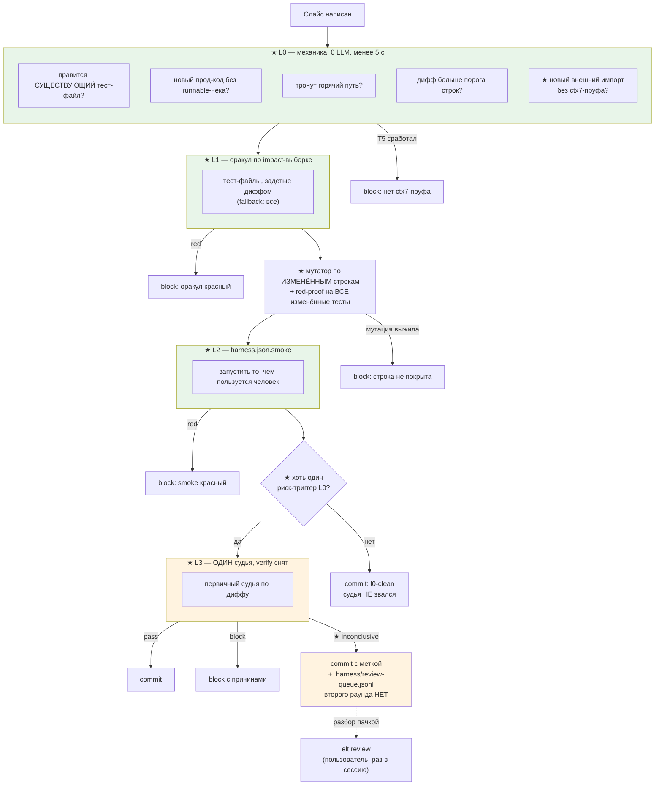

# 011 — ELT v3: гейт по риску вместо конъюнкции двух REJECT-default судей

Вход: `.planning/ELT-V3-DESIGN-BRIEF.md` (измеренный диагноз, схемы A/B/C, требования 31.07).
Разбор со схемами: `claude.ai/code/artifact/d5632c82-8e6b-4223-95d7-3b8d7cb46072`.

## Проблема

Гейт защищает не там, где ломается, и блокирует то, что не ломается.

**Ложные блоки перемножаются.** `tools/fleet/gate.js:474 runJudge` зовёт двух судей независимо
(verify не видит вердикт первого — свежий `judgeDiff`), оба REJECT-default, итог = конъюнкция:

    P(pass) = 0,83 × 0,32 × 0,92 ≈ 0,24     факт 14/62 = 0,23

| Замер (24.07→30.07, `.git/elt/run-log.jsonl`, 270 записей) | Значение |
|---|---|
| block-rate судьи | 77% (48 block / 14 pass / 7 dead) |
| из них verify заблокировал при `pass` первичного | 36 из 48 |
| первичный судья (настоящий контроль) | 7 |
| `grounding:no-reasons` (сбой парсера, не качество) | 5 |
| codex/gpt-5.6-sol в роли verify | block-rate 68%, калибровка НИКОГДА не мерилась |
| прогонов судьи / оракула на 1 коммит | 5,75 / 5,3 |
| оракул p50 / p90 / max | 185 / 250 / 311 c (все 60 тест-файлов, всегда) |
| файлов / тест-файлов в типичном слайсе | 4 / 1 |
| покрытие гейта (коммиты через `elt commit`) | 70% → **29%** после 24.07 |
| рекорд осцилляции | T008 — 9 блоков за 12,5 ч, первичный каждый раз `pass` |

Цена платится каждым слайсом целиком: оракул гоняет все тест-файлы независимо от диффа
(`elt-oracle-runner.js:discover`), судья читает дифф целиком до `DIFF_CAP`. Когда гейт дороже
работы, его обходят — и 29% покрытия это ровно то, что видно в git.

**Защита стоит не в том месте.** Три уехавших регресса (D0) — рантайм собранного приложения.
Оракул = юнит-тесты, судья = дифф; шага «запусти то, чем пользуется человек» в петле нет.

**Три слепые зоны без механики.** (1) Качество тестов не меряется ничем: `red-proof` даёт
`skipped: no-new-tests`, то есть правка *существующего* теста проскакивает слой целиком.
(2) Внешние либы: `ctx7` — дисциплина без зубов, машинный след (`~/.claude/ctx7-cache/access.log`)
мёртв с 18.06 вместе со снятым AMOS-хуком. (3) `elt.js:675` принимает литерал
`--attested-by fleet-gate` от любого вызывающего — люк самозаверения переименован, а не закрыт
(codex-судья заблокировал это по делу 29.07).

## Решения (зафиксированы с пользователем 2026-07-31)

Грилл, 2 раунда, 8 вопросов. Решения:

1. **Риск-триггер — фиксированный список, не числовой скор.** Судья (L3) зовётся, если выполнено
   хотя бы одно: правится СУЩЕСТВУЮЩИЙ тест-файл; новый прод-код без нового runnable-чека; тронут
   «горячий» путь (гейт/деньги/секреты/auth); дифф больше порога строк. Обученный скор отвергнут:
   калибровать нечем — первичных блоков в истории всего 7, а 36 из 48 блоков это verify-шум,
   и обучение на нём выучит шум.
2. **`inconclusive` — неблокирующая очередь.** Строка в `.harness/review-queue.jsonl` + метка в
   коммите, разбор пользователем пачкой (`elt review`) раз в сессию. Второго раунда судьи на том
   же слайсе нет — осцилляция исключена физически, а не промптом.
3. **L2 smoke — единый контракт `harness.json.smoke`**, строка команды по форме существующего
   `oracle`; поля нет → слоя нет (обратная совместимость). Содержимое per-project.
4. **Качество тестов — свой мутатор по ИЗМЕНЁННЫМ строкам**, ~100 строк на stdlib. Stryker
   отвергнут: первая зависимость в репо без `package.json`, не знает наш оракул (`node <file>`,
   смесь `node:test` и plain-скриптов), мутирует файл целиком вместо диффа. Обязательное
   предусловие — L1 impact-выборка (иначе N × 185 c неподъёмно). Другие стеки: поле в
   `harness.json`, слой просто не включён.
5. **Context7 — пруф-файл в репо + L0-блок.** L0 видит в диффе новый внешний импорт/зависимость →
   требует свежую запись в `.harness/ctx7-proof.jsonl` (library-id, запрос, ts); пишет её уже
   существующая обёртка `tools/context7-cli.js`. Нет записи → block. Глобальный кэш-лог отвергнут:
   вне репо, не едет с коммитом, писателя пришлось бы воскрешать.
6. **Люк `--attested-by` удаляется целиком.** При `attest:true` `judge-proof write` отвергается
   ВСЕГДА; fleet пишет proof не через CLI-флаг, а вызовом той же функции, что `elt judge run`
   (in-process). Люка нет вовсе, а не подписан — подпись цепи (nonce/HMAC) отвергнута как
   криптография ради одного внутреннего вызова.
7. **Порядок — dogfood с первого слайса (§3.1 брифа).** T001 = снять verify + измерить одиночного
   первичного на judge-bench; диффа там на одну строку конфига, он пройдёт даже текущим гейтом.
   Дальше хвост 010 (T004/T006/T007/T008 — написаны, зелёные, лежат в дереве) закрывается уже
   облегчённым гейтом, по одному слайсу: батч из 8 упёрся в `DIFF_CAP` и был заблокирован
   формулировкой «части диффа обрезаны» — это не качество, это ровно чинимый дефект.
8. **Хвост 010 переезжает сюда.** T005 (люк), T009 (авто-чекпоинт), T010 (скиллы), T011 (живой
   блок в чужом проекте) — слайсы 011: T005 меняет форму по решению 6, T011 — естественная
   приёмка НОВОГО гейта, а не старого. `stash@{0}` = `batch2-T005-T009-T010-T011`, не потерян.

**Разведано кодом, не спрошено:** `stash@{0}` содержит второй батч; run-log имеет `commit`, но не
размер диффа (реконструируется из git); `red-proof.js:60` даёт `skipped: no-new-tests`;
`elt-oracle-runner.js:discover` берёт все `tools/**/*.test.js` всегда; `judge-bench.js` уже умеет
`--out` с JSON-отчётом; в репо нет `package.json` (нулевые зависимости); дерево с T004/T006/T007/
T008 зелёное — 3/3 PASS.

## User stories

- **US1.** Как разработчик, я закрываю чистый слайс без вызова LLM-судьи вообще: L0 видит, что
  риск-триггеров нет, и гейт заканчивается за секунды — я перестаю обходить его руками.
- **US2.** Как разработчик, я получаю от судьи третий исход `inconclusive` вместо блока: работа
  коммитится с меткой, вопрос уходит в очередь, и я не жгу 12 часов на девять раундов.
- **US3.** Как разработчик, я не могу тихо сдать слайс с бутафорским тестом: мутация изменённых
  строк, которую не поймал ни один тест, блокирует слайс механически.
- **US4.** Как разработчик, я не могу написать код против внешней либы по памяти: новый импорт без
  свежего пруфа context7 не проходит.
- **US5.** Как владелец системы, я вижу, что регресс рантайма ловится до коммита: `harness.json.smoke`
  запускает то, чем пользуется человек, и красный smoke блокирует.
- **US6.** Как владелец системы, я знаю цену контура числом: judge-bench меряет каждую правку
  гейта, а не «кажется, стало лучше».

## Схема (гейт после 011; ★ — новое)

## Критерии приёмки

- **AC1.** `.harness/harness.json` этого репо не содержит `judge.verify`; `verifySettings` для него
  возвращает `null`. Одиночный первичный судья измерен на judge-bench (14 кейсов), число в отчёте.
- **AC2.** L0 — чистая функция от (дифф, status, конфиг) → `{triggers[], judgeNeeded}`, без единого
  вызова LLM и без сети. Тест на каждый триггер по отдельности и на пустой набор.
- **AC3.** Слайс без риск-триггеров закрывается БЕЗ вызова судьи; в run-log видно `l0-clean` и
  список проверенных триггеров (пустой). Тест: судья-стаб не вызван ни разу.
- **AC4.** Вердикт `inconclusive` проводится через гейт: коммит проходит, метка в сообщении,
  строка в `.harness/review-queue.jsonl` (task, commit, причина, ts). Повторный прогон судьи на
  том же слайсе не запускается. Тест на все три исхода.
- **AC5.** `elt review` печатает очередь и закрывает записи; закрытая запись не возвращается.
- **AC6.** L1: оракул на слайсе из 4 файлов гоняет подмножество тест-файлов, а не все 60. Fallback
  «все» при недоступном/устаревшем индексе — с явной причиной в отчёте. Тест на обе ветки.
- **AC7.** `red-proof` больше не даёт `skipped: no-new-tests` при изменённом существующем
  тест-файле — он обязан упасть на baseHead. Тест на новый и на изменённый файл.
- **AC8.** Мутатор: изменённая строка, поломка которой не роняет ни один тест, даёт `block` с
  указанием файла и строки. Тест на выжившую и на убитую мутацию.
- **AC9.** Новый внешний импорт/зависимость в диффе без свежей записи в `.harness/ctx7-proof.jsonl`
  → `block`. Запись пишет `tools/context7-cli.js`. Тест на обе ветки.
- **AC10.** `harness.json.smoke` пустой/отсутствует → слоя нет (старое поведение); задан → команда
  исполняется, ненулевой код возврата = `block`, вывод в отчёт. Тест на все три случая.
  Плюс слой включён живьём хотя бы в одном реальном проекте: зелёный smoke не мешает прогону,
  красный валит `elt oracle` ненулевым кодом и оставляет хвост в `oracle-tail.log`.
- **AC11.** Флаги `--skip-attest` и `--attested-by` не распознаются вовсе; при `attest:true` ручной
  `judge-proof write` отвергается безусловно. Fleet пишет proof in-process. Тест: старые вызовы
  больше не проводят вердикт.
- **AC12.** Живой блок в чужом проекте (`C:/Ametrin projects/Задача фузи музи`) новым гейтом, без
  установки контура в тот проект — мост судьи резолвится глобально: `block` на диффе с нарушением
  и `pass`/`l0-clean` на чистом. Пруф — записи в его `.git/elt/run-log.jsonl`.
  Проект приёмки сменён с `Route_API_1C` решением 01.08: приёмка ведётся там же, где включается
  L2 (AC10), — один живой проект вместо двух.
- **AC13.** Итоговый замер: block-rate нового контура на judge-bench и доля слайсов, дошедших до
  L3, — числами против baseline 77% / 100%.

## Риски

- **R1. L0 пропустит настоящий дефект.** Фиксированный список триггеров — это заведомо неполная
  модель риска. Смягчение: список консервативен (при сомнении триггер срабатывает), L1/мутатор/smoke
  стоят ДО развилки и работают всегда, а не только на рисковых слайсах.
- **R2. Мутатор дорог даже с L1.** N мутаций × прогон подвыборки. Смягчение: жёсткий бюджет
  (максимум мутаций на слайс + таймаут); превышение = `inconclusive`, не блок и не тихий пропуск.
- **R3. `inconclusive` станет мусоропроводом.** Если судья начнёт отвечать им на всё, гейт
  выродится в лог. Смягчение: доля `inconclusive` — метрика AC13; порог назван в чекпоинте, рост
  выше него = дефект контура, а не норма.
- **R4. Очередь ревью никто не разберёт.** Неблокирующая по решению 2. Смягчение: `doctor` показывает
  длину очереди; накопление видно, но работу не стопорит (осознанный выбор пользователя).
- **R5. ctx7 может быть мёртв/недоступен.** Блок по AC9 остановит работу из-за внешнего сервиса.
  Смягчение: недоступность ctx7 (а не отсутствие пруфа) даёт `inconclusive` с причиной, не `block`.
- **R6. Импакт-выборка ошибётся и пропустит красный тест.** Смягчение: fallback «все» при любой
  неуверенности индекса; `codegraphGuard` уже ловит мёртвый/устаревший индекс.
- **R7. Dogfood-порядок: новый слой сломается на живом слайсе.** По §3.1 это пруф дефекта, а не
  повод откатиться к старому пути — фиксируется в чекпоинте и чинится следующим слайсом.
- **R8. Снятие verify уронит качество.** Именно поэтому T001 несёт замер на judge-bench, а не
  «сняли и посмотрим»: одиночный первичный получает число ДО того, как на нём поедут слайсы.

## Оракул

`node tools/elt-oracle-runner.js` (все `tools/**/*.test.js`). После закрытия L1-слайса — он же,
но по impact-выборке; полный прогон остаётся приёмочным для слайсов, трогающих сам гейт.

## Вне scope

- **Схема B (проверка после коммита с авто-revert)** — режим поверх A, отдельной спекой после
  живого замера A.
- **Слой эволюции из схемы C** (разбор трейсов → правка харнесса с предсказанием эффекта →
  фальсификация) — начинать с него нельзя: на 77% ложных блоков он выучит шум. После AC13.
- **Fleet A/B** — при гейте 50% потолок Амдала ≈ 2,0×, замер мерил бы стоимость гейта, а не
  эффект флота. После закрытия 011.
- **Мутационное тестирование на не-JS стеках** — поле в `harness.json` предусмотрено, реализация нет.
- **Числовой риск-скор с обучением** — отвергнут решением 1, вернуться можно, когда наберётся
  честная разметка блоков «по делу / ложно».
- **Удаление кода verify-пути из `gate.js`** — конфиг выключен (T001), путь используется fleet
  (`fleet.js:182 judgeAwayFrom`); удаление — после того, как L3-маршрутизация вытеснит его совсем.
