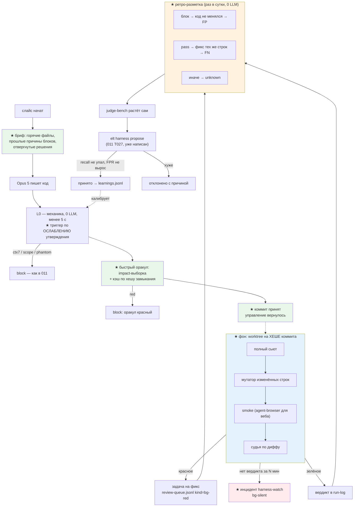

# 014 — ELT v4: экзоскелет вместо клетки

Вход: разбор 2026-08-09 (артефакт `claude.ai/code/artifact/e28c7ef9-85c7-413c-8477-17d9ef457a45`),
замеры из `.git/elt/run-log.jsonl` (424 записи, 10.07→05.08), `.planning/GATE-011-VERDICT.md`,
`.harness/health.jsonl`. Предшественник — спека 011 (закрыта 03.08).

## Проблема

Контур 011 сделал гейт дешевле и честнее, но остался **клеткой**: он проверяет модель, вместо того
чтобы её питать. На Opus 5 такая рамка стала налогом, и её обходят целиком.

| Замер (`.git/elt/run-log.jsonl`, 424 записи, 10.07→05.08) | Значение |
|---|---|
| коммитов через `elt` с 05.08 по 09.08 | **0** (было 150 за предыдущие 15 активных дней, 10/день) |
| цикл слайса p50 / p90 | 16 / 84 мин |
| оракул p50 / p90 / max | 175 / 250 / 363 c (суммарно 5,6 ч) |
| судья p50 / p90 / max | 58 / 193 / 540 c (суммарно 4,0 ч) |
| прогонов гейта на 1 коммит | 2,83 |
| доля слайсов без судьи (`l0-clean`) | 12,8% (5 из 39) |
| триггер `existing-test-modified` | сработал 30 раз из 39 — не различает |
| FPR / recall судьи (judge-bench, 22 кейса) | 45,5% / 90,9% |
| остановок на 150 коммитов (`judge-block`+`red-stop`+`judge-dead`) | 93 |
| `judge-dead` / `timeout` | 8 / 3 — вердикта нет вообще |
| записей в `.harness/learnings.jsonl` | **файла не существует** |
| инцидентов `health.jsonl`, вызвавших действие | 0 из 3 |

**Три следствия одного корня — «петля разомкнута».**

1. **Проверка стоит на критическом пути.** Ожидание 4–6 мин из 16-минутного цикла (24–35%). Пока
   она там стоит, любое усиление контура (мутатор `elt-mutate.js` написан T008 и не подключён;
   второй судья снят T001; полный сьют только перед merge) оплачивается временем человека — поэтому
   не включается. Гейт одновременно медленный **и** слабый, и это не два дефекта, а один.
2. **Сигналы копятся, решения принимает рука.** `elt harness propose` (011 T027) написан и ни разу
   не применялся; `harness-watch` пишет `block-pattern` и никто их не потребляет; 424 вердикта не
   размечены на «по делу / ложно» — а значит FPR 45,5% нечем снижать, кроме догадок.
3. **Контур не едет за пределы этого репо.** Аудит 29.07 уже фиксировал: контур судьи жил ТОЛЬКО в
   репо-разработчике. `smoke` (011 AC10) включён живьём в одном чужом проекте, `oracleSelect: impact`
   и L0-триггеры не раскатаны нигде: `project-bootstrap` их не ставит.

**Механическая причина медленного оракула названа в коде.** `tools/elt-oracle-select.js:11-15`:
замер 31.07 — `codegraph affected` возвращает `affectedTests: []` для каждого файла (43 import-узла
на 288 файлов, рёбра `require()` не проиндексированы). Импакт-выборка держится на текстовом
обратном скане, и её потолок — те самые 175 c при 82 тест-файлах.

## Решения (зафиксированы с пользователем 2026-08-09)

1. **Проверка уходит с критического пути, а не сокращается.** `elt commit` возвращает управление
   после L0; тяжёлое (полный сьют, мутатор, smoke, судья) исполняется фоном. Это ровно условие,
   записанное в `specs/011/tasks.md`: «Схема B … браться после вердикта T015, если A не дотянет по
   времени слайса». T015 закрыт 03.08, время слайса не дотянуло.
2. **Фон работает по ХЕШУ коммита в `.fleet-wt/`, а не по живому дереву.** Иначе запись следующего
   слайса даёт `stale-tree` — инфраструктура worktree уже есть и простаивает с 01.08.
3. **Красное фоновой проверки не блокирует, а рождает задачу.** Формат — существующая
   `.harness/review-queue.jsonl` (011 T012) с новым `kind`, а не второй механизм.
4. **Тихая смерть фона — сама инцидент.** `judge-dead` (8) и `timeout` (3) дают отсутствие вердикта,
   а не красное. «Нет вердикта за N минут» → инцидент `harness-watch`. Без этого спекулятивный
   коммит вырождается в «коммить и забудь».
5. **Триггер спрашивает про ослабление утверждения, а не про факт правки теста.** Удалён `assert`,
   ослаблено сравнение, вырезан кейс, уменьшено число проверок → триггер. Дописан новый тест → нет.
   Порог решается механикой по diff-строкам, без AST-парсера (ponytail: AST — когда эвристика
   промахнётся на живом слайсе, а не заранее).
6. **Кэш оракула по хешу транзитивного замыкания.** Тест не перезапускается, если ни один файл в
   его замыкании не изменился. Инвалидация — по содержимому, не по времени.
7. **Разметка вердиктов ретроспективно, механикой над git.** Блок, после которого код тех же файлов
   почти не менялся и был закоммичен → ложный блок. `pass`, после которого в окне N коммитов пришёл
   фикс, трогающий те же строки → пропуск. Неуверенность → `unknown`, не догадка. Это перенос SZZ
   (Śliwerski/Zimmermann/Zeller 2005) с кода на вердикты гейта; известный риск шумных меток
   смягчается коротким окном и явной долей `unknown` в отчёте.
8. **Размеченные кейсы пополняют judge-bench автоматически**, и правка триггеров/промпта идёт
   через уже написанный `elt harness propose` — принимается, только если recall не упал и FPR не
   вырос. Ничего нового для эволюции не пишется: замыкается существующее.
9. **Экзоскелет едет в другие проекты через скилловый слой, а не копированием.** `project-bootstrap`
   ставит новые поля `harness.json`; `elt` SKILL.md описывает новый режим; `doctor` показывает
   состояние фона и очередь; `sync-agent-surface` зеркалит на codex/gemini. Без этой фазы спека
   повторит дефект «контур жил только в репо-разработчике».
10. **Инструменты усиливают только внутри фона.** `agent-browser` как L2 smoke для веб-проектов,
    `elt-mutate.js` и полный сьют — включаются там, где их цена не оплачивается временем человека.
    Новых скиллов и MCP не добавляется: при ~80 установленных маржинальная польза около нуля, а
    контекстный налог реален (`tools/hook-diet.js`, `tools/token-impact.js`).

## User stories

- **US1.** Как разработчик, я вижу «коммит принят» через секунды после L0 и сразу начинаю следующий
  слайс — проверка идёт без меня.
- **US2.** Как разработчик, я получаю больше проверок, чем раньше (полный сьют + мутатор + smoke +
  судья), и это не стоит мне ни минуты ожидания.
- **US3.** Как разработчик, я не теряю красное: фоновый провал приходит задачей в очередь, а
  молчание фона выше таймаута — инцидентом.
- **US4.** Как владелец системы, я не калибрую гейт на глаз: вердикты размечаются по git, кейсы
  сами попадают в judge-bench, правка проходит `elt harness propose`.
- **US5.** Как владелец системы, я ставлю экзоскелет в новый проект одной командой
  `project-bootstrap`, а не переносом файлов руками.
- **US6.** Как разработчик, я получаю перед слайсом выжимку по коду, который собираюсь трогать:
  где раньше ломалось и за что блокировали — до написания кода, а не после.

## Схема (гейт после 014; ★ — новое)

## Критерии приёмки

- **AC1.** Кэш оракула: тест-файл, чьё транзитивное замыкание не изменилось по содержимому, не
  запускается; результат берётся из кэша с пометкой в отчёте. Изменение любого файла замыкания
  инвалидирует запись. Тест на попадание, на промах и на инвалидацию.
- **AC2.** Триггер `weakened-assertion` заменяет `existing-test-modified`: правка теста, снимающая/
  ослабляющая утверждение, даёт триггер; чистое добавление кейса — нет. Тест на каждую форму
  (удалён `assert`, `strictEqual`→`ok`, вырезан блок кейса, добавлен новый тест).
- **AC3.** `elt commit` при `verify: "background"` возвращает управление после L0 и быстрого
  оракула; в run-log появляется запись `status: "committed-speculative"` с хешем коммита. Тест:
  команда завершается, фоновая проверка ещё не завершена.
- **AC4.** Фон исполняется в worktree, привязанном к хешу коммита; запись в основное дерево во
  время фоновой проверки не влияет на её результат и не даёт `stale-tree`. Тест: правка файла в
  основном дереве между стартом и финишем фона.
- **AC5.** Красный фон пишет запись `kind: "bg-red"` в `.harness/review-queue.jsonl` с task,
  коммитом, слоем (`suite`/`mutate`/`smoke`/`judge`) и причиной; `elt review` её показывает и
  закрывает. Тест на каждый слой.
- **AC6.** Отсутствие вердикта фона дольше `backgroundTimeoutMin` даёт инцидент `bg-silent` в
  `health.jsonl` (идемпотентно по `key`). Тест: стаб, который не отвечает.
- **AC7.** В фоне гоняются ВСЕ слои сразу: полный сьют (без `oracleSelect`), `elt-mutate.js`,
  `smoke` (если задан), судья. Отключение любого — поле в `harness.json`, по умолчанию все включены.
  Тест: отчёт фона содержит четыре секции.
- **AC8.** Ретро-разметка — чистая функция от (run-log, git-история) → `{verdictId, label, evidence}`
  с метками `false-block` / `missed-defect` / `correct` / `unknown`, без LLM и без сети. Доля
  `unknown` печатается. Тест на каждую метку по фикстуре git.
- **AC9.** Размеченные `false-block` и `missed-defect` пополняют `tools/judge-bench/cases.js`
  (или его файл-хранилище) без ручного редактирования; повторная разметка не плодит дублей.
  Тест на идемпотентность.
- **AC10.** `elt harness propose` применяется живьём хотя бы один раз: `.harness/learnings.jsonl`
  существует и содержит ≥ 1 запись с вердиктом `accepted` либо `rejected` и числами до/после.
- **AC11.** Бриф слайса: `elt brief --files <...>` печатает по тронутым файлам частоту прошлых
  красных/блоков и топ причин из run-log; работает без сети, укладывается в 2 c. Тест на пустой
  и на непустой результат.
- **AC12.** `project-bootstrap apply` ставит в новый проект поля `verify`, `oracleCache`,
  `backgroundTimeoutMin` и не ломает проекты со старым `harness.json` (отсутствие полей = поведение
  011). Тест на новый проект и на существующий конфиг.
- **AC13.** `doctor` показывает: режим verify, длину очереди `bg-red`, число `bg-silent` за окно,
  дату последней ретро-разметки. Тест на секцию отчёта.
- **AC14.** Живой прогон в чужом проекте: экзоскелет включён в одном реальном проекте пользователя,
  зафиксирован спекулятивный коммит и один фоновый красный, доведённый до фикса. Пруф — записи в
  его `.git/elt/run-log.jsonl` и `review-queue.jsonl`.
- **AC15.** Итоговый замер против baseline этой спеки: цикл слайса p50, ожидание гейта p50,
  число слоёв проверки на слайс, FPR на bench, число записей в `learnings.jsonl`, доля фоновых
  красных, дошедших до фикса. Отчёт — `.planning/GATE-014-VERDICT.md`.

## Риски

- **R1. Спекулятивный коммит превращается в «коммить и забудь».** Главный риск спеки. Смягчение:
  AC5 (очередь), AC6 (инцидент на молчание), AC15 (доля красных, дошедших до фикса — метрика
  приёмки). Если доля < 100% — вариант откатывается к фазе A, а не «донастраивается».
- **R2. Фон в worktree разойдётся с реальностью проекта** (внешние сервисы, БД, порты). Смягчение:
  `smoke` в фоне запускается только если проект объявил его безопасным для параллельного прогона
  (`smokeParallel: true`), иначе слой пропускается с причиной, а не падает.
- **R3. Кэш оракула замаскирует красный тест.** Смягчение: ключ кэша — хеш содержимого всего
  транзитивного замыкания плюс версия раннера; любая неуверенность (не разобрали замыкание) →
  запуск. Полный сьют в фоне всё равно гоняет всё без кэша.
- **R4. Ретро-разметка даст шумные метки** (известная проблема SZZ). Смягчение: короткое окно,
  сверка по строкам из diff, явная метка `unknown`, доля `unknown` в отчёте; кейс попадает в bench
  только при однозначной метке.
- **R5. Триггер по ослаблению пропустит настоящее ослабление** (переписан тест целиком). Смягчение:
  полная переписка тест-файла (> 50% строк) остаётся триггером; в фоне тот же дифф всё равно видит
  судья.
- **R6. Раскатка в чужие проекты сломает их гейт.** Смягчение: отсутствие новых полей = поведение
  011 (AC12); включение — явное, не по умолчанию.
- **R7. Исполнитель слайсов — Sonnet 5, не Opus.** Смягчение: развилки решены в этой спеке,
  каждая задача несёт `[files:]` и «Проверяемо:»; при неоднозначности слайс паркуется, а не
  решается на месте.

## Оракул

`node tools/elt-oracle-runner.js`. Перед закрытием спеки — `node tools/elt-oracle-runner.js --full`.

## Вне scope

- **Флот гипотез (вариант 3 разбора)** — N worktree на один слайс. Только после AC15: иначе цена
  гейта умножается на число веток.
- **Числовой риск-скор с обучением** — по-прежнему нечем калибровать до накопления разметки (AC8).
  Вернуться после того, как ретро-разметка даст ≥ 100 однозначных меток.
- **AST-парсер для триггера ослабления** — решение 5: эвристика по diff-строкам, парсер только
  после живого промаха.
- **Новые скиллы и MCP** — решение 10.
- **Авто-revert фоновой красноты** — очередь и задача на фикс, но не автоматический откат коммита:
  откат чужой работы без спроса опаснее, чем красная строка в очереди.
