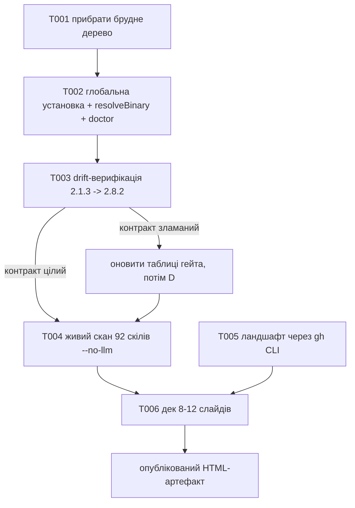

# 015 — Безпека агентських скілів: глобальний SkillSpector + доповідь

## Проблема

1. **Сканер є, але він репо-локальний і застарілий.** `tools/skill-scan.js` уже обгортає NVIDIA
   SkillSpector, але бінар живе в `vendor/skill-packs/skillspector/.venv` і має версію **v2.1.3**
   (10 червня 2026). Upstream уже на **v2.8.2** (7 серпня 2026). Наслідки:
   - жоден інший проєкт на машині не може викликати гейт — тільки цей репо;
   - між 2.1.3 і 2.8.2 вийшло ~15 фіксів саме на **documentation false positives**
     (PE3/RA1/TM1/AR2, SC7, YARA, markdown-таблиці) — тобто рівно на ту проблему, заради якої
     `skill-scan.js` і будував власний «чесний гейт». Ми досі платимо за обхід, який upstream
     частково закрив.
2. **92 скіли в `~/.claude/skills` ніколи не сканувалися новою версією.** Це supply chain, який
   виконується з повними правами агента, і його стан невідомий.
3. **Потрібна доповідь на Zoom (5–10 хв)** про встановлення й налаштування безпеки для ІІ-агентів
   через SkillSpector, з живими числами й картою суміжних інструментів.

## Решения (Рішення)

- Поставити SkillSpector **глобально** (`uv tool install`, pin на тег), щоб бінар був доступний
  з будь-якого проєкту, а не з одного репо.
- `resolveBinary()` у `skill-scan.js` шукає global-first і падає назад на vendored venv.
- **Обов'язково перевірити drift 2.1.3 → 2.8.2**, перш ніж перемикати гейт: `skill-scan.js`
  хардкодить rule ID (`P5`, `AST8`, `TT3`, `TT5`, `YR1..YR4`), назви категорій і поля JSON.
  Якщо контракт змінився, гейт тихо змінить сенс — це головний ризик задачі.
- Прогнати живий скан 92 глобальних скілів і зберегти JSON-звіт — це водночас proof інтеграції
  та центральні числа доповіді.
- Дослідити ландшафт GitHub-інструментів безпеки ІІ-агентів **через `gh` CLI** (WebSearch
  заборонений) і звести в один звіт.
- Зібрати дек на 8–12 слайдів українською як HTML-артефакт.

## User stories

- Як власник машини, я хочу викликати `skillspector scan <path>` з будь-якого проєкту, а не лише
  з Pipeline Setupper.
- Як власник harness, я хочу, щоб `doctor` показував, чи сканер є і якої він версії, — щоб
  «гейт увімкнений» не було вірою.
- Як доповідач, я хочу показати числа зі **своєї** машини, а не зі слайдів вендора.

## Критерии приёмки (Критерії приймання)

1. `skillspector --version` → `2.8.2` з довільної директорії (або через явно зареєстрований
   shim-шлях, якщо PATH на Windows його не бачить).
2. `node tools/skill-scan.js <fixture> --json` на новому бінарі дає ті самі семантики виходу
   (0 pass / 4 review / 3 blocked / 2 error), а поля JSON, які читає обгортка, існують.
3. Hard-block ID (`P5`, `AST8`, `TT3`, `TT5`, `YR1..YR4`) і код-категорії підтверджені проти
   реєстру правил v2.8.2 — не за пам'яттю, а з бінаря чи його джерел.
4. `node tools/doctor.js` показує рядок про SkillSpector: наявність + версія.
5. Є JSON-звіт скану всіх скілів `~/.claude/skills` і зведені числа (скільки pass / review /
   blocked, топ-категорії).
6. Є звіт по ландшафту інструментів; кожен інструмент перевірений через `gh` (зірки, дата
   останнього коміту), жодного з пам'яті.
7. Є опублікований HTML-дек 8–12 слайдів українською, який читається за 5–10 хв.

## Риски (Ризики)

- **Контрактний drift 2.1.3 → 2.8.2** — головний. Мітигація: T003 як окремий слайс перед
  перемиканням; тримати vendored fallback тільки якщо семантика гейта збігається.
- **Windows PATH**: uv кладе shim у `~/.local/bin`, якого може не бути в PATH. Мітигація:
  додати цей каталог у кандидати `resolveBinary()`, а не воювати з PATH.
- **Python 3.11.6 локально**, SkillSpector вимагає 3.12+. Мітигація: `uv tool install --python 3.12`.
- **Egress**: LLM-стадія відправляє вміст файлів провайдеру. Мітигація: скан 92 скілів робити
  `--no-llm`; LLM показати на 1–2 скілах через `claude_cli` (без API-ключа).
- **Дослідження з'їсть сесію.** Мітигація: таймбокс, ландшафт — 1–2 слайди, не центр доповіді.

## Вне scope (Поза scope)

- Заміна власного «чесного гейта» на upstream-мапінг `SAFE/CAUTION/DO_NOT_INSTALL` — окреме
  рішення після того, як стане видно, скільки doc-FP лишилося у 2.8.2.
- Блокування встановлення скілів у реальному часі (pre-install hook) — тут лише сканер і звіт.
- Прогін SkillSpector в CI інших проєктів.
- Переклад доповіді на інші мови.

## Flow

