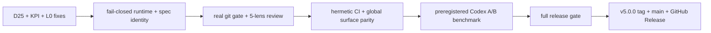

# 020 — ELT v5: fail-closed сертифікація Codex і приватний випуск

## Проблема

Спека 019 зібрала release candidate, але реальні фонові прогони після комітів знайшли три
розбіжності, які не можна ховати під тегом `v5.0.0`:

- D25: checkpoint hook мав неправильний профіль для `claude-opus-5`, втрачав `elt status`
  після зняття deploy-копії та міг перезаписувати ручний resume;
- фон T016 довів, що числа README не замкнені на versioned snapshot і частина чисел не має
  власної команди перевірки;
- фон T018 довів, що фільтр import-тексту пропускає виконуваний JavaScript у private field
  (`#client = require(...)`) та у `${...}` template expression.

Окремо ELT v5 писався насамперед під Claude Code. Локальні тести й Codex як fallback-judge
не доводять, що чистий проєкт може встановити плагін і провести реальну кодову задачу під
керуванням Codex від відкритої задачі до commit/run-log.

Аудит перед T001 2026-08-24 додатково довів, що початкові T001–T006 не закривають сам
release-контур:

- `dead`/невалідний фоновий judge може завершитися як `background-verify-pass`, а exception
  після створення worktree лишає orphan без terminal-запису;
- parked/review state ідентифікує задачі лише як `Txxx`, тому однакові ID різних spec
  маскують або масово закривають чужі записи;
- managed pre-commit лежить у `.githooks/`, але `core.hooksPath` не активований; локальний
  doctor цього не доводить;
- пʼять review-лінз і confidence scorer існують як ручний `/elt-verify`, але канонічний gate
  запускає одного content-judge й автоматично не пише weak signals у ledger;
- GitHub Actions на HEAD `2851db1` червоний на Windows і Ubuntu, хоча локальний повний oracle
  зелений 77/77: частина тестів залежить від домашніх skills/CLI автора;
- глобальні Codex/Claude/Gemini skills лишилися v4, тоді як plugin surface уже v5.

## Решения

Закрити три знайдені розбіжності окремими слайсами, потім зробити release-контур fail-closed:
terminal-state фону, spec-bound runtime identity, справді активний git gate, канонічні пʼять
лінз з одним confidence-рішенням, герметичний CI і doctor реального runtime closure.

Після цього провести аудит глобальних hooks/surfaces за канонічними source/налаштуваннями та
виконати дві живі перевірки:

1. чиста установка приватного marketplace;
2. preregistered A/B на зафіксованих задачах авторитетного benchmark: той самий Codex,
   prompt, budget і незмінні grader-тести у двох arms (`plain` та `ELT`), причому ELT-arm
   завершується справжнім commit/run-log і terminal background-result.

Лише після цього закрити 019/T020, поставити SemVer tag, створити `main`, GitHub Release і
залишити відтворюваний release runbook.

## User stories

- Як користувач Codex, я хочу той самий маршрут `spec → oracle → judge → elt commit`, що й у
  Claude Code, без залежності від `~/.claude/bin/elt.js`.
- Як власник релізу, я хочу, щоб кожне число і кожний tag перевірялися механічно.
- Як оператор довгої сесії, я хочу, щоб checkpoint не ротував 1M-модель як 200k і не стирав
  ручний resume.
- Як автор гейта, я хочу, щоб ослаблення false-positive не створювало false-negative у
  синтаксисі JavaScript.
- Як оператор фону, я хочу, щоб `dead`, malformed, timeout або exception ніколи не ставали
  зеленим terminal-result і не лишали orphan-worktree.
- Як власник багатьох spec, я хочу, щоб `T005` однієї spec не міг park/close `T005` іншої.
- Як читач GitHub, я хочу бачити не self-reported adoption, а preregistered A/B benchmark із
  сирими результатами, test hashes і чесною межею узагальнення.

## Критерии приёмки

- D25 має регреси на `claude-opus-5`/small-моделі, збереження ручного хвоста, gateActive і
  пошук CLI з розгорнутого hook; deployed copy побайтно збігається із source.
- L0 бачить import/require у JS private field і `${...}`, але ігнорує їх у звичайних рядках
  та справжніх коментарях; негативні й позитивні кейси проходять одним тестом.
- README KPI читаються з versioned snapshot або команди з фіксованим `--as-of`; тест
  червоніє, якщо числа README розійшлися зі snapshot.
- Усі активні глобальні hooks мають визначене походження; посилань на видалені ELT-шляхи
  немає. Знайдений drift або синхронізований, або записаний issue з доказом.
- Фон має взаємовиключні terminal-стани `pass`/`red`/`inconclusive`/`error`; лише явний
  conclusive green дає `pass`. Cleanup працює через `finally`, а два історичні `bg-silent`
  core-комміти reconciled доказом, не видаленням каталогу навмання.
- Parked/review записи несуть `specPath` і достатню identity (`task`, а для фону також
  `commit`/`layer`); legacy rows мігруються fail-closed. Явний `--spec` ніколи не маскується
  одноіменним task ID з іншої spec.
- Bootstrap активує реальний git gate і verify перевіряє саме виконуваний hook. Помилки
  `treeHash`/overflow і push дають non-zero, а не warning-success.
- Канонічний review запускає пʼять незалежних лінз паралельно та один confidence scorer;
  `<80` автоматично пишеться як `weak-signal`, `>=80` впливає на terminal verdict. Це той самий
  runtime у sync і background, а не лише prose-команда Claude Code.
- CI hermetic і зелений на `windows-latest` та `ubuntu-latest` без ambient `~/.claude/skills`
  або локально встановленого judge. Actions закріплені immutable SHA; plugin doctor перевіряє
  замикання реального `/elt` route.
- У чистому профілі marketplace ставиться з `prodelt/elt-harness`; Claude plugin і Codex-native
  surface мають v5 parity без залежності від `~/.claude/bin/elt.js`.
- Codex certification використовує preregistered benchmark A/B. Proof містить benchmark і
  upstream SHA, task IDs, seed/test hashes, однакові model/effort/budget, grader results,
  wall-clock, model calls, token/cost або чесне `missing`, ELT commit SHA, oracle/verdict,
  terminal background-result і run-log. Один кейс доводить plumbing, але не superiority;
  directional claim дозволений лише після щонайменше трьох пар.
- Перед тегом: review queue не містить відкритих записів поточного релізу, повний oracle
  зелений, немає `bg-silent`/orphan для release-коммітів, remote CI зелений, версія однакова
  в manifest/marketplace/CHANGELOG/tag.
- GitHub: приватний `main`, feature-ветка, tag `v5.0.0`, Release notes, CI на push/PR і
  документований SemVer-процес наступного випуску. README має benchmark-таблицю та посилання
  на raw/preregistered evidence без тверджень, яких вибірка не доводить.

## Риски

- Живий Codex/Claude transport може бути недоступним. Це дає `inconclusive`/parked, а не
  ручну атестацію.
- Branch protection може бути недоступний для приватного репозиторію за поточним тарифом.
  Тоді API-відмову записати дослівно, а не оголошувати захист увімкненим.
- Глобальні hooks належать користувацькому середовищу. Міняти лише доведені копії source;
  невідомі hooks не видаляти.
- A/B дорогий і стохастичний. Порядок arms і задачі фіксуються до результатів; однаковий
  success із overhead >25% означає, що на цьому класі звичайний Codex ефективніший.
- Пʼять лінз збільшують model calls. Вони працюють після commit у background і не повертаються
  на критичний шлях; timeout/dead дає видимий error, а не зелений або нескінченний retry.

## Вне scope

- Публікація репозиторію у public.
- Переписування ядра до цілі ≤5 000 рядків.
- Виправлення D12 стороннього `agent-browser` і D24 Linux test-runner у цьому релізі.
- Автоматичний rollback уже створених спекулятивних комітів.
- Повний 500-task SWE-bench Verified або статистично значуще доведення superiority. У реліз
  входить відтворюваний A/B pilot; великий benchmark лишається окремим post-release gate.



## Доповнення 2026-08-24: повернення до початкового graph harness

Це доповнення **не скасовує і не викидає** жодне підготовлене рішення або завдання. Воно додає
відсутній продуктовий контракт, без якого попередній reliability-контур сертифікував би
надійнішу, але архітектурно іншу систему. Durable IDs початково approved spec збережено:
`T005` лишається Codex certification/benchmark, `T006` — release; нові reliability-слайси
перенумеровано `T007–T012`, щоб старий proof `020/T005` ніколи не означав іншу роботу.

### Канонічне джерело

Початковий задум ELT v5 зафіксований у
`.planning/ELT-V5-CONCEPT-2026-08-22.html` (SHA-256
`239F0A1F4780EFAB5D4722A80AE2B7438B76942F236E137163BF1AD7A2AFB62E`). Наданий користувачем
`Пересборка ELT.html` є збереженою оболонкою того самого Claude Artifact; реальний payload —
`Пересборка ELT_files/saved_resource.html` (SHA-256
`43295BF1B8FFA5DB9F9F45196BF3E024E10523E46F2EB55EE64F576670245064`). Обидва файли
зберігаються без змін.

Канон задає не ручну послідовність команд, а тришаровий graph harness:

1. **Земля** — стан, реєстр дефектів і зовнішні capability providers.
2. **Петля** — механічний граф `розвідка → [план] → збірка → посадка → розбір`.
3. **Дзеркало** — hash-bound перевірка результату і зворотний звʼязок у наступну сесію.

### Діагностичний verdict перед релізом

Стан на `HEAD 2851db1` — **RELEASE BLOCK** для `v5.0.0`. Система корисна як
imperative/spec harness, але ще не відповідає початковому graph-harness контракту.

| Властивість | Що реально є | Розбіжність із початковою v5 |
|---|---|---|
| Runtime UX | ручний `oracle → judge → commit` | немає transition reducer, node/edge/guard і автоматичного advance |
| Critical path | oracle та sync judge можуть стояти до commit | до локального commit мав лишитися тільки L0 |
| Batch | comma-string `T001,T002`, один gate на ручний список | немає `batchId`, dependency/risk planner, barrier і failure localization |
| Mirror | detached worktree і heavy background layers частково є | один judge, fail-open terminal defects, немає повного feedback loop |
| Review | пʼять лінз/scorer існують як окрема поверхня | canonical sync/background path їх не використовує |
| State | `.planning`, checkpoint і кілька JSONL | немає одного versioned graph state та deterministic resume |
| Composition | plugin façade і власні команди | немає component manifest/lock, namespaced packs і capability negotiation |
| Update | зміна version у marketplace | немає staging, semantic diff, scanner, canary, atomic promotion і rollback |
| Розмір | 27 784 рядки `tools/ + bin/`, з них 13 851 production | початковий thin-core target `≤3 500` не виконано |
| Release evidence | локальний oracle був 77/77, plugin doctor 8/8 | remote CI червоний; doctor не доводить реальний route closure |

Сильні частини, які треба зберегти: L0, impact oracle, proof binding до дерева/commit,
detached hash worktree, defect ledger, plugin packaging і велика regression suite. Неправильно
побудовані частини: ручний imperative orchestration, голий task ID, background fail-open,
ambient global state, один judge як authority і відсутність supply-chain boundary.

Поточна telemetry підтверджує проблему не лише архітектурно: 642 run-log entries, 153 gate
runs, 141 judged runs і 267 commits; gate coverage 55,8%, block rate 46,8%, L0-clean лише
7,84%, oracle p50 161 s і p90 300 s. Тобто ELT дає сильні докази на ризиковій роботі, але
для звичайної невеликої правки користувач раціонально обирає plain agent через latency.

Інженерна scorecard до benchmark (експертна оцінка, не marketing claim):

| Вимір | Оцінка | Пояснення |
|---|---:|---|
| Початкова концепція | 8/10 | правильний thin composer, fast landing і feedback loop |
| Поточний synchronous core | 7/10 | сильні proofs/tests, але ручна й дорога церемонія |
| Відповідність початковій v5 | 4/10 | plugin façade є, runtime graph і composition відсутні |
| Корисність для high-risk solo work | 7/10 | краще за plain mode, якщо certificate справді fail-closed |
| Корисність для дрібних daily tasks | 4/10 | p50/p90 oracle і шум нівелюють користь |
| Масштабованість поточної реалізації | 3/10 | global state, task collisions, monolith і ambient dependencies |
| Готовність private `v5.0.0` | 2/10 | red CI, false-green background і graph-conformance block |

Порівняно з аналогами ELT має унікально сильні hash-bound proof та retrospective defect ledger,
але поступається DeepSeek у plugin lifecycle, OpenShell в isolation, ECC у managed ownership і
Spec Kit у spec authoring. Graph-pack модель дозволяє використати ці сильні сторони без другого
власного engine; саме після цього проєкт може масштабуватися як серйозний control plane.

### Продуктова межа ELT v5

ELT не стає універсальним workflow engine на кшталт Cordis. Власне release-core володіє лише:

- валідацією та редукцією графа;
- registry/lock для component packs;
- append-only journal і deterministic resume;
- authority boundaries для spec approval, certification, publish і release;
- hash-bound evidence та реєстром розходжень вердикту з реальністю.

Плагіни, skills, CLI та MCP дають здібності, але **ніколи** не володіють oracle truth,
terminal verdict, commit/push або release.

Мінімальний контракт вузла:

```json
{
  "id": "pack/node",
  "kind": "source|action|decision|gate|barrier|sink",
  "consumes": ["schema/ref"],
  "produces": ["schema/ref"],
  "guards": ["mechanical predicate"],
  "sideEffects": ["workspace|git|network|secrets|none"],
  "trust": "core|reviewed|unreviewed",
  "platforms": ["win32", "linux", "darwin"],
  "timeoutMs": 120000,
  "failure": "block|degrade|skip"
}
```

Graph compiler відхиляє duplicate IDs, schema mismatch, неоголошені side effects, недоступну
platform capability, цикл без явного loop-edge та спробу зовнішнього pack заволодіти
`approve`, `certify`, `commit`, `push` або `release`.
Для identity, approve, oracle, certify, certificate, commit, merge, tag, push і release compiler
завжди навʼязує `failure:block`; `skip/degrade` допустимі тільки для неавторитетного enrichment.

Кожне evidence envelope містить щонайменше `runId`, `graphVersion`, `componentLockDigest`,
`specIdentity`, ordered `taskIdentities`, `batchId`, `generation`, `baseHead`, `batchHead`,
`treeHash`, `nodeId`, monotonic `seq`, certificate type і рівно один terminal state.

### Канонічний runtime-граф

| Вузол | Guard / перехід | Доказ | Невдача / resume |
|---|---|---|---|
| `recon` | знайома зона і ≤3 файли → `build`; інакше → `plan` | scope/impact snapshot | повторне читання не змінює state |
| `plan` | explicit user approval trailer → `build` | canonical digest без execution status | зміна intent робить approval stale |
| `build` | task dependencies closed → `landing` | task checkpoints і focused tests | red лишає task відкритою |
| `landing` | L0 green → локальний provisional batch commit | commit/tree/batch identity | L0 red не створює commit |
| `mirror` | immutable batch SHA → oracle + review graph | raw output, proofs, scorer | dead/malformed/timeout = terminal error |
| `debrief` | finding `≥80` → `recon`; `<80` → ledger | finding IDs і confidence | replay ідемпотентний |
| `certified` | oracle green + review terminal + same hashes | certificate | stale proof блокує publish |
| `publish` | лише certified commit | push/release receipt | external failure = non-zero і retryable |

Canonical UX — одна поверхня `elt run|advance|status --json`. Низькорівневі `oracle`, `judge`,
`commit` лишаються diagnostic escape hatch, але не шляхом, який користувач має памʼятати.
Раніше записаний у цій spec маршрут `spec → oracle → judge → commit` зберігається як
compatibility/reliability target для старого CLI, але **не** є canonical product route v5.

### Batch замість judge/oracle після кожної T

- Default batch — 3 задачі, максимум 4, лише з однієї approved spec.
- Planner перевіряє dependency closure, перетин файлів, side-effect/risk zones і platform.
- Focused regression tests виконуються всередині `build` до події `ready`; у самій швидкій
  `landing` лишається тільки L0. Повний oracle і model judge після кожної T не запускаються.
- Після 2–4 T створюється один локальний provisional batch commit. Він не push/merge/release
  authority і залишається у quarantine.
- На одному `batchHead` запускаються один impact oracle та один review-subgraph. Застосовні
  лінзи визначає core-owned deterministic table, яка входить у evidence; high-risk/release
  batch запускає всі пʼять; один scorer формує terminal verdict.
- На одній branch дозволений один незавершений uncertified batch. Поки Mirror працює, інша
  незалежна робота може йти в іншому worktree/branch, але не будувати publish-chain поверх
  uncertified commit.
- Red повертає той самий логічний `batchId` у `build`; forward repair commit збільшує
  `generation`, оновлює `batchHead`, а proofs старої generation стають stale. Другий
  uncertified batch не створюється. `Inconclusive` або infra error не стають зеленими.
- Release виконує full oracle один раз після всіх certified batch.

Після journal cutover `tasks.md` зберігає immutable intent. Авторитетний execution status живе
в journal як `open → built → landed → certified`; checkbox і state.md — rebuildable projections.
Approval digest хешує лише canonical spec/plan/task descriptions і ніколи не залежить від checkbox.

Щоб T001 справді залишався першим, до commit, який закриває T015, діє явно versioned
`legacy-v1` epoch: поточні checkbox, approval trailer, commit і run-log залишаються авторитетним
старим механізмом. T014 готує й перевіряє journal migration, звіряючи `specPath`, task, commit,
tree та proof, але старий write-path лишається authoritative. T015 атомарно вмикає нову
runtime-двері після успішного replay; неоднозначність або відсутній proof блокує cutover.
`legacyEpochEnd` — exact T015 commit; після нього checkbox більше не є write-path. Історичні
записи не видаляються та не перепризначаються.

Canonical approval digest має schema `elt-approval/v1`: repo-relative POSIX path і file role,
порядок `spec.md` → `tasks.md`, порядок task як у файлі, UTF-8, LF та Unicode NFC; checkbox
execution marker нормалізується до `[ ]`, решта тексту не переписується. SHA-256 рахується над
length-prefixed canonical records, щоб межі файлів не були двозначними. Один golden fixture
мусить давати однаковий digest на Windows і Linux; зміна schema робить старий approval stale.

Точна алгебра batch-pass: oracle exit 0; усі required lenses terminal-success; scorer
terminal-success; жодної finding із confidence `≥80`; усі graph/lock/spec/batch/generation/
commit/tree hashes збігаються. `Unknown/error/inconclusive/stale` блокують publish.

Таким чином важкі перевірки запускаються **після кількох T**, а не після кожної, але їхня
строгість і hash binding не слабшають.

### Component packs і рішення за аудитом upstream

Усі snapshots clean і pinned; жоден upstream-код не копіюється в ELT автоматично.

| Upstream snapshot | Рішення для v5 |
|---|---|
| `rtk-ai/rtk@29f9bb7` | optional output reducer; exit/raw output — джерело істини, RTK лише presentation |
| `NVIDIA/SkillSpector@698e2bf` | обовʼязковий pre-activation scanner pinned local staging; CAUTION/incomplete/error block |
| `NVIDIA/OpenShell@7fc6138` | optional strong-isolation adapter після WSL2/Linux probe; Landlock тільки `hard_requirement` |
| `affaan-m/ECC@d8409a4` | pattern/catalog source: ownership, digest, dry-run, repair; full profile/hooks/update відхилені |
| `deepseek-ai/deepseek-harness@b150a55` | pattern для lifecycle/disposer/provider seams; optional runner post-release, не gate authority |
| `github/spec-kit@27f50f7` | importer шаблонів `constitution/spec/plan/tasks`; explicit spec dir і ELT approval identity |
| `mattpocock/skills@5b15a47` (`1.2.3`) | повний supported promoted pack як namespaced graph-pack `grail/*` |

DeepSeek `BENCHMARK.md` не є незалежним benchmark: там немає dataset, scorer, baseline або
статистичного протоколу. ECC `git pull` updater, dev symlink installer Matt skills і будь-який
mutable `latest` route не використовуються.

### Повна інтеграція `mattpocock/skills` — GrailPack

«Повністю» означає всі **25 supported promoted skills** із upstream manifest, а не 11
`misc`/`in-progress`/`deprecated`, які сам upstream не випускає. Pack pinned до commit і
manifest SHA-256 `6B5C85512785D36D6DA4561BB309AC11E8BD6C0C028D5777740DC01147A6A025`.

- Усі 25 entries видимі в registry, versioned, namespaced `grail/<name>` і доступні за
  upstream user/model invocation metadata.
- `ask-matt` імпортується як карта підграфів, але єдиним top-level router лишається ELT.
- `to-spec`/`to-tickets` пишуть через ELT artifact adapter; issue tracker не стає другим
  source of truth.
- `implement` стає composite node `tdd → review → return evidence`; його прямий commit
  перехоплюється і замінюється `landing/mirror/certified`.
- `code-review` дає незалежні осі Standards і Spec як findings; final verdict належить ELT
  scorer, а не другому judge.
- `research`, `prototype`, `wizard`, setup та issue/network/secret writes виконуються тільки
  через оголошені graph edges. `wizard` — explicit human-only і sandboxed.
- Немає глобальних symlink/copy install, name collisions або `scripts/link-skills.sh`.
- Windows smoke обовʼязковий: upstream shell files у поточному checkout отримали CRLF і
  падають під `bash -n`, тому shell-backed nodes disabled до LF-preserving adapter.

Authority policy pack не може змінити:

```yaml
owns_spec: elt
owns_tasks: elt
owns_oracle: elt
owns_judge: elt
owns_commit: elt
owns_publish: elt
implicit_default: false
```

Це не лише manifest policy. External node працює в окремому worker з default-empty toolset і
отримує `fs/git/network/secret/process` лише через core capability broker за declared edge.
Broker журналює request/result і не передає raw host credentials. Якщо platform не може
забезпечити цей boundary, executable pack node має стан `unavailable`; optional OpenShell лише
посилює isolation, але його відсутність не перетворює policy на самоатестацію. Prompt-only node
без broker capabilities може повернути тільки schema-validated evidence/proposal, а всі writes
виконує trusted core після guard.

### Безпечне автоматичне оновлення

Автоматизується пошук і перевірка candidate, а не сліпе виконання нового prompt/code:

1. discover candidate і resolve exact commit/version;
2. materialize у content-addressed staging;
3. verify source allowlist, hashes, license, path/symlink containment;
4. parse explicit manifest, виконати semantic capability diff;
5. SkillSpector scan із `--fail-on-incomplete`;
6. Windows/Linux contract smoke; optional OpenShell canary для executable pack;
7. graph conformance і authority-bypass tests;
8. human approval при новому/видаленому node, invocation/side-effect/secret/git/network diff;
9. atomic pointer switch; попередня версія зберігається для rollback;
10. update receipt пишеться в journal і GitHub evidence.

Docs-only patch без capability diff може auto-promote після всіх green gates. Новий unsigned
prompt або branch-tip не активується unattended. `components.lock` є частиною certificate;
зміна lock робить старий proof stale.

Promotion виконує лише trusted-core updater, чий digest не входить до candidate: pack/candidate
не може сканувати, схвалювати, підвищувати або підміняти сам себе. Кожний execution run на `recon`
фіксує immutable snapshot `components.lock`; update є окремим graph-run і стає видимим лише
наступному execution run. Rollback — це forward-only перемикання на попередні перевірені bytes із
новою lock generation та новим receipt, а не переписування чи видалення історії.

### Обʼєктивні benchmarks і GitHub evidence

Primary evaluators не належать ELT:

- `SWE-bench/SWE-bench@7a21e057` — Docker evaluator і real-world issue tasks;
- `Aider-AI/aider@7e0611e` (`benchmark/`) — швидкий cross-language editing pilot;
- `SWE-rebench/SWE-rebench-V2@c71902a` — optional decontaminated follow-up.

Для кожної preregistered task створюються paired arms `plain agent` і `same agent + ELT` від
одного seed SHA. Model/provider/effort/budget/prompt, grader/test hashes і worker/coding timeout
однакові; порядок arms randomized до результату. Judge ELT не може бути grader benchmark.

Preregistration до першого запуску фіксує dataset revision, evaluator/toolchain OCI image digest,
canonical primary endpoint, task IDs, retry limit, valid-infrastructure-failure та exclusion policy.
Після першого result ці поля immutable; відхилення лишається у raw evidence, а не тихо вилучається.
Coding-agent budget однаковий в обох arms. ELT review/certification overhead не збільшує цей coding
budget і звітується окремо. Primary endpoint для обох arms — candidate commit, переданий тому
самому незалежному grader; це єдина база pass-rate comparison. Для ELT окремо фіксується
certification ceiling від candidate commit до terminal certificate, а третя колонка показує
повний total-arm system budget/cost/time. Certification timeout не може тихо скоротити або
розширити worker timeout і класифікується як ELT overhead/infra outcome.

Raw evidence містить hidden-grader pass/fail, escaped defects, false block/miss/unknown,
wall-clock `prompt→local commit` і `prompt→certified`, model/tool calls, tokens/cost або чесне
`missing`, human interventions, graph overhead, component lock і всі commit hashes.

- 1 paired task доводить лише plumbing.
- 3 paired tasks дозволяють тільки directional pilot без claim superiority.
- ≥30 randomized pairs дають directional GitHub claim з confidence interval.
- ≥100 pairs або повний прийнятий benchmark потрібні для сильного marketing claim.

README/GitHub Pages таблиця генерується з commit-bound JSON. Ручне редагування цифр або
вибір лише вдалих задач заборонено.

### Додаткові acceptance gates graph v5

- Усі legal/illegal edges, skip-plan, stale guard, duplicate event, crash/restart, timeout,
  malformed terminal, spec-ID collision і state-schema migration мають runnable tests.
- `ready_to_local_commit` p95 `<5 s` на зафіксованому corpus; окремо публікуються
  `certification` p50/p90, щоб не ховати heavy latency.
- До private release обовʼязкові instrumentation і preregistration для adoption через ELT та
  signal/noise. Самі пороги `≥80%` на тижневому вікні й `≥1:1` на 20 нових diff є
  post-release observational promotion gates: до достатнього вікна вони мають статус
  `not yet measured`, а не блокують чесний перший private tag і не стають fake pass.
- Жоден benchmark не замінює ці workflow KPI; наступний promotion/marketing claim блокується,
  якщо спостережувані пороги не виконані.
- Release-core `≤3 500` production LOC або окремий явний user-approved rebaseline. Новий
  graph reducer `≤1 500` production LOC і не тягне універсальний plugin engine.
- Один source schema для Claude/Codex/open-agent surfaces; fresh install, upgrade, cache
  refresh і rollback доведені на Windows та Linux.
- Tag/push/release неможливий без terminal certificate того самого `graphVersion`, lock,
  spec, batch і commit.

Попередній пункт `Вне scope` про повне переписування до `≤5 000` лишається історією вже
підготовленого reliability-плану. Це доповнення не вимагає rewrite заради rewrite, але повертає
thin-core KPI як release gate: до explicit rebaseline його не можна мовчки оголосити виконаним.

### Фінальний release certificate

Batch certificate і release certificate мають різні versioned schemas та не взаємозамінні.
Release schema містить `releaseId`, ordered `specIdentities[]`, ordered
`includedBatchCertificateDigests[]`, release commit/tree/graph/lock hashes і машинний proof, що
в усіх включених spec немає open release tasks, stale generation або невключеного certified batch.
Фінальний протокол рівно такий: `prepare-release` commit із version/docs/state/queue → full oracle →
усі пʼять lenses незалежно від impact → scorer → out-of-tree release certificate на точні
commit/tree/spec/graph/lock hashes → immutable annotated tag `v5.0.0` на той самий commit →
push/tag/GitHub Release receipts. Certificate та receipts живуть в append-only evidence store або
release assets і не змінюють certificate-bound tree. Після `prepare-release` до tag не дозволено
жодного запису в цей tree; будь-яка зміна починає новий `prepare-release` commit і повністю повторює
протокол. Green batch certificate сам по собі не дає release authority.

Після push verifier повторно читає remote tag і доводить exact SHA та no-force/tag-protection rule.
Якщо GitHub plan/API не дозволяє rule, receipt зберігає точну відмову й `tagProtection: unavailable`;
release не може рекламувати cryptographic/remote immutability, хоча локальна certificate binding
лишається перевірюваною.

Годинний дедлайн є timebox виконання, а не дозвіл на false-green. Claude Code має повторно
використати наявні L0/oracle/review/ledger primitives і спочатку дати вузький usable graph
slice. Якщо до 60 хвилин release gates не зелені, результатом є чесний приватний RC з exact
blocker, але не фальшивий tag `v5.0.0`.

Self-contained implementation entrypoint:

Implementation-Packet-SHA256: `87EC9211AEB5C5A69BBD58B0223BEB08D8F81C5FBD2BE6F95C9720BC3F336510`

- `CLAUDE-CODE-1H-LAUNCH.md` — точний one-hour orchestration, safety і evidence contract;
- `upstreams.lock.json` — exact upstream/benchmark commits без mutable `latest`.
- `implementation-packet.lock.json` + `verify-packet.js` — spec-bound hashes усіх control inputs;
  preflight має завершитися `status: pass` до T001.

Графічні джерела та render artifacts:

- `specs/020-elt-v5-codex-release-certification/diagrams/elt-v5-graph-harness.*` — три шари й component packs;
- `specs/020-elt-v5-codex-release-certification/diagrams/elt-v5-batch-certification.*` — кілька T, один Mirror;
- `specs/020-elt-v5-codex-release-certification/diagrams/elt-v5-safe-update.*` — staging, scan, canary, promotion і rollback.
