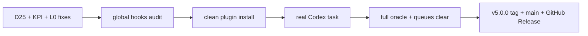

# 020 — ELT v5: сертифікація Codex і випуск

## Проблема

Спека 019 зібрала release candidate, але реальні фонові прогони після комітів знайшли три
розбіжності, які не можна ховати під тегом `v5.0.0`:

- D25: checkpoint hook мав неправильний профіль для `claude-opus-5`, втрачав `elt status`
  після зняття deploy-копії та міг перезаписувати ручний resume;
- фон T016 довів, що числа README не замкнені на versioned snapshot і частина чисел не має
  власної команди перевірки;
- фон T018 довів, що фільтр import-тексту пропускає виконуваний JavaScript у private field
  (`#client = require(...)`) та у `${...}` template expression.

Окремо ELT v5 писався насамперед під Claude Code. Локальні тести й Codex як fallback-judge
не доводять, що чистий проєкт може встановити плагін і провести реальну кодову задачу під
керуванням Codex від відкритої задачі до commit/run-log.

## Решения

Закрити три знайдені розбіжності окремими слайсами, провести аудит глобальних hooks за
канонічними source/налаштуваннями, а потім виконати дві живі перевірки:

1. чиста установка приватного marketplace;
2. реальна зміна коду в окремому git-проєкті з `judge.provider=codex`, зеленим oracle,
   verdict і комітом через ELT.

Лише після цього закрити 019/T020, поставити SemVer tag, створити `main`, GitHub Release і
залишити відтворюваний release runbook.

## User stories

- Як користувач Codex, я хочу той самий маршрут `spec → oracle → judge → elt commit`, що й у
  Claude Code, без залежності від `~/.claude/bin/elt.js`.
- Як власник релізу, я хочу, щоб кожне число і кожний tag перевірялися механічно.
- Як оператор довгої сесії, я хочу, щоб checkpoint не ротував 1M-модель як 200k і не стирав
  ручний resume.
- Як автор гейта, я хочу, щоб ослаблення false-positive не створювало false-negative у
  синтаксисі JavaScript.

## Критерии приёмки

- D25 має регреси на `claude-opus-5`/small-моделі, збереження ручного хвоста, gateActive і
  пошук CLI з розгорнутого hook; deployed copy побайтно збігається із source.
- L0 бачить import/require у JS private field і `${...}`, але ігнорує їх у звичайних рядках
  та справжніх коментарях; негативні й позитивні кейси проходять одним тестом.
- README KPI читаються з versioned snapshot або команди з фіксованим `--as-of`; тест
  червоніє, якщо числа README розійшлися зі snapshot.
- Усі активні глобальні hooks мають визначене походження; посилань на видалені ELT-шляхи
  немає. Знайдений drift або синхронізований, або записаний issue з доказом.
- У чистому git-проєкті marketplace ставиться з `prodelt/elt-harness`, plugin doctor зелений.
- Реальна кодова задача під Codex завершується commit через ELT; proof містить SHA, oracle
  exit 0, Codex verdict і запис run-log. Мок judge або лише локальний unit-test не приймається.
- Перед тегом: review queue не містить відкритих записів поточного релізу, повний oracle
  зелений, версія однакова в manifest/marketplace/CHANGELOG/tag.
- GitHub: приватний `main`, feature-ветка, tag `v5.0.0`, Release notes, CI на push/PR і
  документований SemVer-процес наступного випуску.

## Риски

- Живий Codex/Claude transport може бути недоступним. Це дає `inconclusive`/parked, а не
  ручну атестацію.
- Branch protection може бути недоступний для приватного репозиторію за поточним тарифом.
  Тоді API-відмову записати дослівно, а не оголошувати захист увімкненим.
- Глобальні hooks належать користувацькому середовищу. Міняти лише доведені копії source;
  невідомі hooks не видаляти.

## Вне scope

- Публікація репозиторію у public.
- Переписування ядра до цілі ≤5 000 рядків.
- Виправлення D12 стороннього `agent-browser` і D24 Linux test-runner у цьому релізі.
- Автоматичний rollback уже створених спекулятивних комітів.

